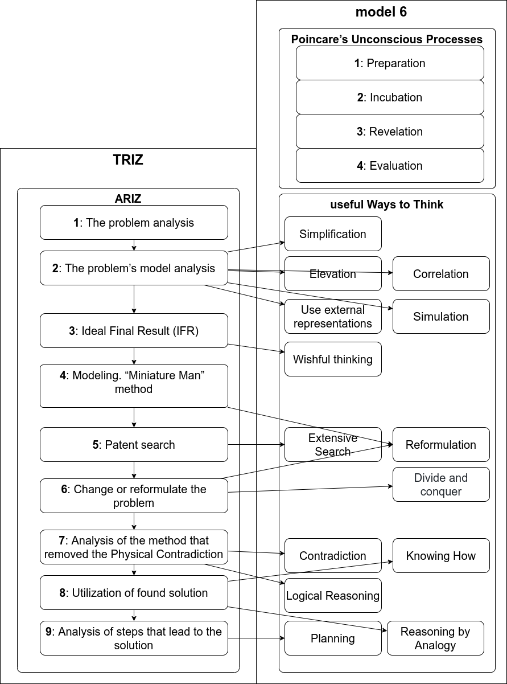

# Intro into TRIZ

## Useful references 
1. https://www.altshuller.ru/
1. https://en.wikipedia.org/wiki/TRIZ
1. https://aitriz.org/articles/40p_triz.pdf
1. http://websites.umich.edu/~scps/html/07chap/html/powerpointpicstriz/Chapter%207%20TRIZ.pdf
2. https://web.archive.org/web/20130410005442/http://www.triz-journal.com/archives/2002/03/b/index.htm

## Levels of innovation 

1. **Simple improvement of a technical system** - well known object with no search for solutions.
1. **Invention includes the resolution of a technical contradiction** - there is the selection of new object from several similar or insignificant improvements were done to initial object.
1. **The invention containing a resolution of a physical contradiction** - the source object is significantly updated.
1. **The development a new technology** - a source object is completely updated.
1. Involves the discovery of new phenomena - a scientific discovery is made and the whole system where the object is included is updated.

## 40 principles of invention

### Principle 5. Merging

A - Bring closer together (or merge) identical or similar objects or
operations in space.
Close to the separate the concerns principle.

### Principle 6. Universality

...

### Principle 20. Continuity of Useful Action.

B - Eliminate all idle or intermittent actions or work
Booted notebooks use.
...

### Principle 22. Blessing in Disguise

A - Use harmful factors (particularly, harmful effects of the
environment or surroundings) to achieve a positive effect
Use arctic cold to cool a data-center.

### Principle 23. Feedback

### Most useful
http://www.ipface.org/pdfs/reading/TRIZ_Principles.pdf

### In short 
https://timeweb.com/ru/community/articles/metod-triz-chto-eto-takoe-i-kak-rabotaet

### In English
https://www.toolshero.com/problem-solving/triz-method/
