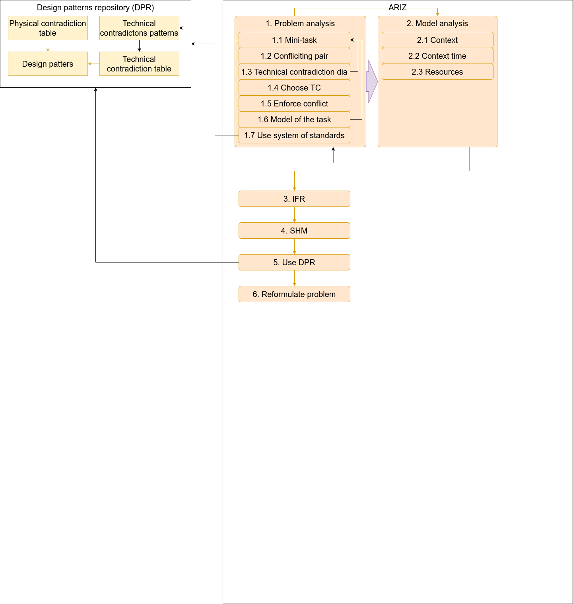
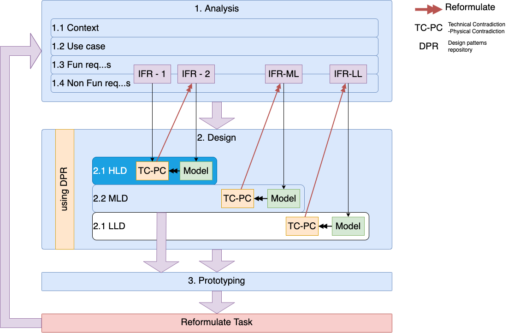
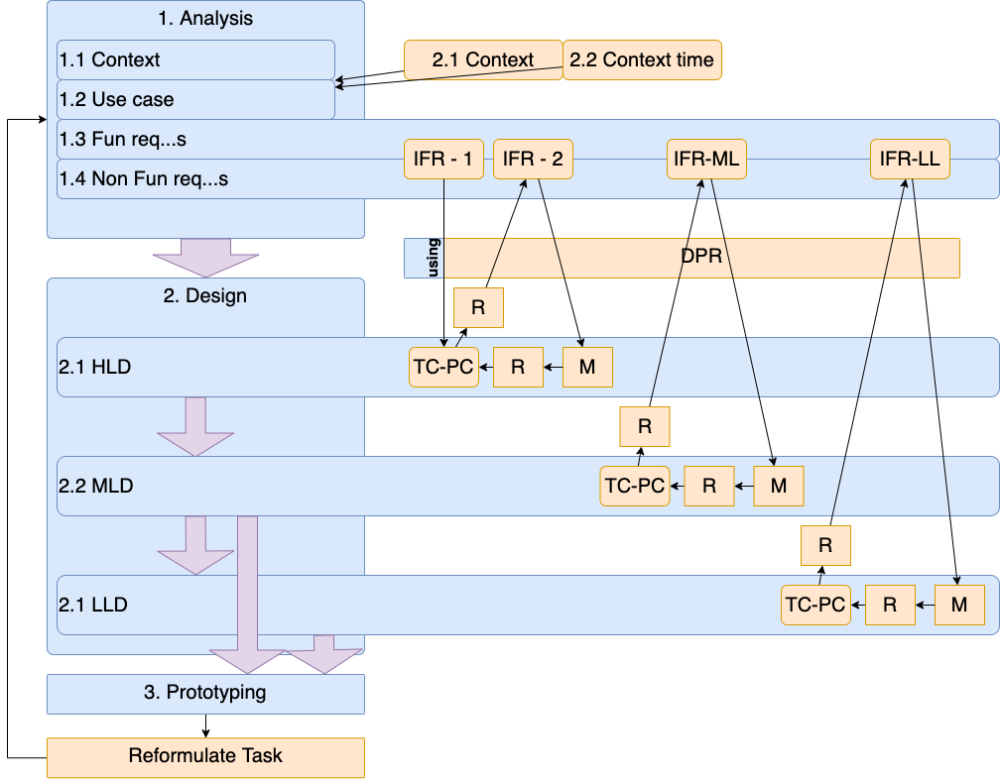

# Intro into TRIZ

## Useful references 
1. https://www.altshuller.ru/
1. https://en.wikipedia.org/wiki/TRIZ
1. https://aitriz.org/articles/40p_triz.pdf
1. http://websites.umich.edu/~scps/html/07chap/html/powerpointpicstriz/Chapter%207%20TRIZ.pdf
2. https://web.archive.org/web/20130410005442/http://www.triz-journal.com/archives/2002/03/b/index.htm

## Model of 6: ways to think

https://github.com/max-talanov/1/blob/master/affective_computing_course/levels_of_mental_activities.md

https://github.com/max-talanov/1/blob/master/affective_computing_course/thinking.md#useful-ways-to-think


## Levels of innovation 


1. **Simple improvement of a technical system** - well known object with no search for solutions.
1. **Invention includes the resolution of a technical contradiction** - there is the selection of new object from several similar or insignificant improvements were done to initial object.
1. **The invention containing a resolution of a physical contradiction** - the source object is significantly updated.
1. **The development a new technology** - a source object is completely updated.
1. **Involves the discovery of new phenomena** - a scientific discovery is made and the whole system where the object is included is updated.

## Poincare’s Unconscious Processes

https://web.media.mit.edu/~minsky/E7/eb7.html

1. **Preparation**: Activate resources to deal with this particular type of problem.
1. **Incubation**: generate many potential solutions.
1. **Revelation**: recognize a promising one.
1. **Evaluation**: verify that it actually works.

**Preparation**: To prepare to solve a specific problem, one first may need to ‘clear one’s mind’ from other goals— for example, by taking a walk, or by finding a quiet place to work. Then one must focus on the problem by deliberating to decide which of its features are central enough to suggest an appropriate Way to Think; here Poincare said, “All my efforts only served at first the better to show me the difficulty.”

**Incubation**: Once the ‘unconscious mind’ is prepared, it can consider large numbers of combinations, searching for ways to assemble those fragments to satisfy the required relations. Poincare wonders whether we do this with a very large but thoughtless search—or if it is done more cleverly.

**Revelation**: When should incubation end? Poincare suggests that it continues until some structure is formed "whose elements are so harmoniously disposed that the mind can embrace their totality while realizing the details." But how does that subliminal process know when it has found a promising prospect?

**Evaluation**: We often hear advice that suggests that it’s safer for us to trust our ‘intuitions—ideas that we get without knowing how. But Poincare went on to emphasize that one cannot always trust those ‘revelations.’

## ARIZ
1. [Laws of TRIZ](https://altshuller.ru/triz/zrts1.asp#tc23)
1. https://www.altshuller.ru/triz/technique2.asp
1. https://www.altshuller.ru/triz/technique1.asp
1. https://www.altshuller.ru/triz/ariz85v.asp
1. https://www.leaneast.com/wp-content/uploads/2020/04/TRIZ-Contradications-Matrix.png
1. https://triztrainer.ru/gsa/?i=24&d=33




### 1. The problem analysis
#### ШАГ 1.1. Записать условия мини-задачи (без специальных терминов) по следующей форме: 

1. Техническая система:для (указать назначение) включает (перечислить основные части системы).
1. Техническое противоречие 1 (ТП-1):(указать).
1. Техническое противоречие 2 (ТП-2):(указать).
1. Необходимо при минимальных изменениях в системе (указать результат, который должен быть получен).

#### ШАГ 1.2. Выделить и записать конфликтующую пару элементов: изделие и инструмент.

#### ШАГ 1.3. Составить графические схемы ТП-1 и ТП-2, используя таблицу 1.

[Таблица 1](https://www.altshuller.ru/triz/ariz85v-t1.asp)

#### ШАГ 1.4. Выбрать из двух схем конфликта (ТП-1 и ТП-2) ту, которая обеспечивает наилучшее осуществление главного производственного процесса (основной функции технической системы, указанной в условиях задачи).

#### ШАГ 1.5. Усилить конфликт, указав предельное состояние (действие) элементов.

#### ШАГ 1.6. Записать формулировку модели задачи, указав:

```
конфликтующую пару; 
усиленную формулировку конфликта; 
что должен сделать вводимый для решения задачи икс-элемент (что он должен сохранить и что должен устранить, улучшить, обеспечить и т.д.).
```

#### ШАГ 1.7. Проверить возможность применения системы стандартов к решению модели задачи. Если задача не решена, перейти ко второй части АРИЗ. Если задача решена, можно перейти к седьмой части АРИЗ, хотя и в этом случае рекомендуется продолжить анализ со второй части.

### 2. The problem's model analysis

#### ШАГ 2.1. Определить оперативную зону (ОЗ). 

The contex of the problem, usually context diagram.

#### ШАГ 2.2. Определить оперативное время (ОВ).

#### ШАГ 2.3. Определить вещественно-полевые ресурсы (ВПР) рассматриваемой системы, внешней среды и изделия. Составить список ВПР.


### 3. Ideal final result (IFR)

#### ШАГ 3.1. Записать формулировку ИКР-1: 

```
икс-элемент, 
абсолютно не усложняя систему и не вызывая вредных явлений, 
устраняет 
(указать вредное действие) 
в течение оперативного времени (ОВ) 
в пределах оперативной зоны (ОЗ), 
сохраняя способность инструмента совершать 
(указать полезное действие).
```

#### ШАГ 3.2. Усилить формулировку ИКР-1 дополнительным требованием: в систему нельз вводить новые вещества и поля, необходимо использовать ВПР.

#### ШАГ 3.3. Записать формулировку физического противоречия на макроуровне: 

```
оперативная зона 
в течение оперативного времени
должна (указать физическое макросостояние, например "быть горячей"), 
чтобы выполнять (указать одно из конфликтующих действий), 
и не должна (указать противоположное физическое макросостояние, например "быть холодной"), 
чтобы выполнять (указать другое конфликтующее действие или требование).

```

#### ШАГ 3.4. Записать формулировку физического противоречия на микроуровне.

#### ШАГ 3.5. Записать формулировку идеального конечного результата ИКР-2: 

```
оперативная зона (указать) 
в течение оперативного времени (указать) 
должна сама обеспечивать (указать противоположные физические макро- или микросостояния).
```

#### ШАГ 3.6. Проверить возможность применения системы стандартов к решению физической задачи, сформулированной в виде ИКР-2. Если задача не решена, перейти к четвертой части АРИЗ.

### 4. Modeling 

#### ШАГ 4.1. Метод ММЧ.

```
а) используя метод ММЧ (моделирование "маленькими человечками"), построить схему конфликта;
б) изменить схему А так, чтобы "маленькие человечки" действовали, не вызывая конфликта;
в) перейти к технической схеме.
```

#### ШАГ 4.2. Если из условий задачи известно, какой должна быть готовая система, и задача сводится к определению способа получения этой системы, можно использовать метод "шаг назад от ИКР". Изображают готовую систему, а затем вносят в рисунок минимальное демонтирующее изменение.

#### ШАГ 4.3. Определить, решается ли задача применением смеси ресурсных веществ.

#### ШАГ 4.4. Определить, решается ли задача заменой имеющихся ресурсных веществ пустотой или смесью ресурсных веществ с пустотой.

#### ШАГ 4.5. Определить, решается ли задача применением веществ, производных от ресурсных (или применением смеси этих производных веществ с "пустотой").

#### ШАГ 4.6. Определить, решается ли задача введением вместо вещества электрического поля или взаимодействием двух электрических полей.

#### ШАГ 4.7. Определить, решается ли задача применением пары "поле - добавка вещества, отзывающегося на поле" (например, "магнитное поле - ферровещество", "ультрафиолет - люминофор", "тепловое поле - металл с памятью формы" и т.д.)

### 5. Patent search

#### ШАГ 5.1. Рассмотреть возможность решения задачи (в формулировке ИКР-2 и с учетом ВПР, уточненных в четвертой части) по стандартам. 

#### ШАГ 5.2. Рассмотреть возможность решения задачи (в формулировке ИКР-2 с учетом ВПР, уточненных в четвертой части) по аналогии с еще нестандартными задачами, ранее решенными по АРИЗ.

...

### 6. Change or reformulate the problem

#### ШАГ 6.1. Если задача решена, перейти от физического ответа к техническому: сформулировать способ и дать принципиальную схему устройства, осуществляющего этот способ.

#### ШАГ 6.2. Если ответа нет, проверить - не является ли формулировка 1.1 сочетанием нескольких разных задач. В этом случае следует изменить 1.1, выделив отдельные задачи для поочередного решения (обычно достаточно решить одну главную задачу).

#### ШАГ 6.3. Если ответа нет, изменить задачу, выбрав на шаге 1.4 другое ТП.

#### ШАГ 6.4. Если ответа нет, вернуться к шагу 1.1. и заново сформулировать мини-задачу, отнеся ее к надсистеме. При необходимости такое возвращение совершают несколько раз - с переходом к наднадсистеме и т.д.

### 7. Analysis of the method that removed the Physical Contradiction

...

#### ШАГ 7.2. Провести предварительную оценку полученного решения.

```
Контрольные вопросы: 

а) Обеспечивает ли полученное решение выполнение главного требования ИКР-1 ("Элемент сам...")? 
б) Какое физическое противоречие устранено (и устранено ли) полученным решением? 
в) Содержит ли полученная система хотя бы один хорошо управляемый элемент? Какой именно? Как осуществлять управление? 
г) Годится ли решение, найденное для "одноцикловой" модели задачи в реальных условиях со многими циклами?
```

#### ШАГ 7.3. Проверить (по патентным данным) формальную новизну полученного решения.

#### ШАГ 7.4. Какие подзадачи возникнут при технической разработке полученной идеи? Записать возможные подзадачи - изобретательские, конструкторские, расчетные, организационные. 

### 8. Utilization of the found solution

#### ШАГ 8.1. Определить, как должна быть изменена надсистема, в которую входит измененная система. 
#### ШАГ 8.2. Проверить, может ли измененная система (или надсистема) применяться по-новому.

#### ШАГ 8.3. Использовать полученный ответ при решении других технических задач:

```
а) сформулировать в обобщенном виде полученный принцип решения;
б) рассмотреть возможность прямого применения полученного принципа при решении других задач;
в) рассмотреть возможность использования принципа, обратного полученному;
г) построить морфологическую таблицу, например, типа "расположение частей - агрегатные состояния изделия" или "использованные поля - агрегатные состояния внешней среды" и рассмотреть возможные перестройки ответа по позициям этих таблиц;
д) рассмотреть изменение найденного принципа при изменении размеров системы (или главных ее частей): размеры стремятся к нулю, размеры стремятся к бесконечности. 
```

### 9. Analysis of method that lead to the solution

#### ШАГ 9.1. Сравнить реальный ход решения данной задачи с теоретическим (по АРИЗ). Если есть отклонения, записать.

...

## Mapping ARIZ to SD process

https://www.youtube.com/watch?v=XKYsteB-KPk






## 40 principles of invention
https://altshuller.ru/triz/technique1.asp
http://www.ipface.org/pdfs/reading/TRIZ_Principles.pdf

### Principle 1. Segmentation 
(**model of 6: Divide and conquer**)

A. Divide an object into independent parts.

### Principle 5. Merging
(**model of 6: Correlation**)


A - Bring closer together (or merge) identical or similar objects or
operations in space.
Close to the separate the concerns principle.

### Principle 6. Universality
(**model of 6:  Elevation**)

...

### Principle 7. Russian Dolls “Nested Doll”

B - Place multiple objects inside others

### Principle 10. Preliminary Action
(**model of 6: Planing, Logical reasoning**)

...

### Principle 11. Beforehand Cushioning
(**model of 6: Planing**)

Back up!


### Principle 13. “The Other Way Round”
(**model of 6: Reformulation, Reasoning by analogy**)

Inverse dependency.


### Principle 20. Continuity of Useful Action.

B - Eliminate all idle or intermittent actions or work
Booted notebooks use.
...

### Principle 22. Blessing in Disguise
(**model of 6: Reformulation**)

A - Use harmful factors (particularly, harmful effects of the
environment or surroundings) to achieve a positive effect

Use arctic cold to cool a data-center.

### Principle 23. Feedback


### Principle 24. Intermediary

Proxy objects.

### Principle 25. Self-service

Self-test. 

### Principle 26. Copying
(**model of 6: Reformulation, Simulation, Use external representations**)

Reformulation.
Using computational models.


#### Most useful
http://www.ipface.org/pdfs/reading/TRIZ_Principles.pdf

#### In short 
https://timeweb.com/ru/community/articles/metod-triz-chto-eto-takoe-i-kak-rabotaet

#### In English
https://www.toolshero.com/problem-solving/triz-method/

## Spiral development


