# Innovation methodology 

## Sources

https://en.wikipedia.org/wiki/TRIZ

https://altshuller.ru/triz/ariz85v.asp

https://www.youtube.com/watch?v=XKYsteB-KPk

https://en.wikipedia.org/wiki/Software_development_process

## Glossary 

1. **SR** - Standards Repository. In terms of ARIZ informfund or information fund.
1. **IFR** - Ideal Final Result the fictional result of development that could be the magical problem solution or customer satisfaction.
1. **TC** - Technical Contradiction The phase of the ARIZ where the engineer has to formalize the technical and of the problem.
1. **PC** - Physical Contradiction. The phase of the IM where the engineer has to formalize the physical contradiction of the problem.
1. **TC-PC** - Technical Contradiction - Physical Contradiction. The phase of the IM where the engineer has to formalize technical and later physical contradiction of the problem.
1. **Early prototyping** - the crucial phase of the IM to test the solution formalized in previous phases for the feasibility study.
1. **Small Dwarfs Modeling approach (SDM)** - the abstract modeling technique with no technical limitations taking in account.
1. **S-Field** the substance-field pair that is main building block of the TRIZ [inventive standards](https://github.com/max-talanov/1/blob/master/Neurotechnologies_and_TRIZ/IM.md#inventive-standards).

## Innovation life-cycle

The proposed innovation methodology is based on the [ARIZ process](https://en.wikipedia.org/wiki/TRIZ) (Algorithm of inventive problems solving (in Russian)) and [Software development life-cycle](https://en.wikipedia.org/wiki/Software_development_process) (SDL).
The SDL contains the following phases: analysis, design, development and validation with further maintenance ... . 
As the Innovation methodology is focused main on solving technical problems 
here we take into account only analysis, design and early prototyping, they are influenced by ARIZ process.
The picture below contains simple waterfall SDL with mapped ARIZ activities
(below we indicate that with the influence of ARIZ SDL convolves into [double-spiral process](https://github.com/max-talanov/1/blob/master/Neurotechnologies_and_TRIZ/IM.md#double-spiral-life-cycle)).

The ARIZ activities are included in so called **Brainstorming cycle** containing IFR, TC-PC and Model (SDM) ([described in details below](https://github.com/max-talanov/1/blob/master/Neurotechnologies_and_TRIZ/IM.md#analysis-and-ifr)) this cycle could be used interchangeably with [brainstorming](https://en.wikipedia.org/wiki/Brainstorming) in the following manner (**I**): 
1. (a) IFR formalization; (b) TC identification; (c) TC solution using the [TC table and 40 principles of invention](https://upload.wikimedia.org/wikipedia/commons/f/fa/1_Le_francais_-_40_principes_d%27invention%2C_2_L%27anglais_-_40_principles_of_invention%2C_3_L%27anglais_-_Contradiction_Matrix_in_TRIZ_method.pdf); (d) if the suitable solution is found go to HLD design.
2. (a) Brainstorming: ideas generation; (b) ideas evaluation; (c) ideas selection; (d) if the suitable solution is identified go to HLD design.
3. Repeat Step 1
4. ...

The other way around (**II**) could be directly after IFR formalization use brainstorming with [40 principles of invention](https://upload.wikimedia.org/wikipedia/commons/f/fa/1_Le_francais_-_40_principes_d%27invention%2C_2_L%27anglais_-_40_principles_of_invention%2C_3_L%27anglais_-_Contradiction_Matrix_in_TRIZ_method.pdf) to generate ideas and select most appropriate using the brainstorming evaluation technique. 

## Analysis and IFR

The analysis phase of the SDL usually contains the context description in the form of [context diagram](https://en.wikipedia.org/wiki/System_context_diagram) that corresponds ARIZ context and is extened with ARIZ context time activities.
Functional and non functional requirements are extended the description of ARIZ Ideal Final Result (**IFR**) in the following form:

	The X element, without additional complications of the system preserving all the useful functions of the system 
	DOES following:
		[useful actions] 
	IN [the context of the system]
	DURING [the context time].

Now we call it **IFR-1** and it stands for version 1 of high level view IFR. The **IFR-2** is the second version or the correction of the IFR after the analysis of the **Technical Contradiction**. The IFR-2 leads to the ARIZ **Modeling** activity.

## Design 

For the inventions/innovations we propose to use the one more approach in combination with ARIZ and SDL - the early prototyping. To develop the prototype as early as one can is crucial for the invention starting from the core functionality towards the *should have* functions of the system. This spiral approach is depicted in [double spiral diagram](#double-spiral-life-cycle).

### High level design

The design starts with the high level view (HLD) where we broadly try to understand the possible solution having functional and non functional requirements in hand as well as IFR.

#### Technical contradiction. Using 40 principles 

Firstly we have to identify the high level Technical Contradictions (**TC**) 
The technical contradiction is the central concept of ARIZ and identifies the technical obstacle to develop the IFR that we have to overcome using invention. 
According to ARIZ we put the TC in the form:

	IF [brief solution description]
	THEN [positive results]
	BUT [negative consequences]
	
We should identify at least two TCs describing opposite solutions, for example using wired and wireless connection.
Both of them should have positive results and negative consequences.

Draw the TCs diagrams according to the reworked ARIZ notation.

##### IM notation

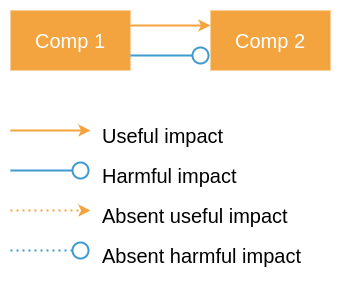

The rectangles (Sys1, Sys2) represent components of the system with two impacts useful and harmful in the same state of the system. The TC diagram revolves around the IFR and the technical impasse to develop and deliver the IFR.
To identify the wishful 
Using the absent useful and absent harmful impact arrows we could describe desired state of the IFR highlighting TC.
As soon as we have identified the first high-level TC we could use 
recommended TRIZ principle using the following resources:

1. [TC table](https://docs.google.com/spreadsheets/d/1x6LbsFmVpPGD1LbLMwTWprrvV5PQQDLLoWGGCdHqn4Y/edit#gid=298366498)
1. [40 principles](https://upload.wikimedia.org/wikipedia/commons/f/fa/1_Le_francais_-_40_principes_d%27invention%2C_2_L%27anglais_-_40_principles_of_invention%2C_3_L%27anglais_-_Contradiction_Matrix_in_TRIZ_method.pdf).
1. [40 principles with examples](http://www.ipface.org/pdfs/reading/TRIZ_Principles.pdf)
1. [TC table (original)](https://altshuller.ru/triz/technique2.asp)
1. [40 principles IT examples](https://github.com/max-talanov/1/blob/master/Neurotechnologies_and_TRIZ/IM.md#40-principles-of-invention-tcs)

#### Physical contradiction. Using standards (Design patterns)

In addition to the TCs we could use the solving physical contradiction (PC) principles if taking into account only TCs does not provide satisfactory solution.

| PC Principle                                                                               | [Standards](https://github.com/max-talanov/1/blob/master/Neurotechnologies_and_TRIZ/IM.md#inventive-standards)      | # |
|--------------------------------------------------------------------------------------------|--------------|---|
| To separate contradictory properties in space                                              |              | 1 |
| To separate contradictory properties in time                                               | [2.3](https://github.com/max-talanov/1/blob/master/Neurotechnologies_and_TRIZ/IM.md#23-evolution-by-coordinating-rhythms) | 2 |
| System transition 1a: merge of homogeneous or non-homogeneous system into super-system     | [3.1](https://github.com/max-talanov/1/blob/master/Neurotechnologies_and_TRIZ/IM.md#31-transitions-to-bi-system-and-poly-system) | 3 |
| System transition 1b: from system to anti-system or their combination                      | [3.1](https://github.com/max-talanov/1/blob/master/Neurotechnologies_and_TRIZ/IM.md#31-transitions-to-bi-system-and-poly-system) | 4 |
| System transition 1c: the whole system has property P while its parts have property anti-P | [3.1](https://github.com/max-talanov/1/blob/master/Neurotechnologies_and_TRIZ/IM.md#31-transitions-to-bi-system-and-poly-system) | 5 |
| System transition 2: to the system operating in micro-level                                | [3.2](https://github.com/max-talanov/1/blob/master/Neurotechnologies_and_TRIZ/IM.md#32-transition-to-micro-level) | 6 |

...

[PC table was adopted using this resource.](https://altshuller.ru/triz/ariz85v-t2.asp)

#### Clarification of IFR 

The TC-PC highlights reasons why we can not implement the IFR in a straightforward manner and if we can not define a satisfactory solution we must use the "step back from IFR" approach.
This way we consider less ideal final result and reformulate **IFR-1** into **IFR-2**.

#### Modeling (SDM)

Using the IFR-2 we can use the other ARIZ tool: the **Small Dwarfs Modeling** approach (SDM).
The SDM is form of wishful thinking:

	Imagine that you have powerful small dwarfs that could "magically" help you solve the problem.
	Draw the system with technical contradiction diagram and extend it with 
	the diagram with small dwarfs acting as technical solution.
	Substitute small dwarfs with technical system/solution.
	
If SDM does not help reformulate high level TC-PC and IFR using one more "step back from IFR" and repeat SDM steps.

We could use this reformulation cycle till we find ourself dead end or find the solution.
In the first case we should reformulate the task 
In the later case we should get to the high level design description using for example UML diagrams and the "traditional" software design approach, with later mid level design description to get as fast as we can to the early prototype.

### Mid level design 

The MLD phase contains similar to the HLD phases with the respect to the abstraction level that we take in account.
If HLD contains the bird eye view on components, deployment and overall behavior of components description the MLD should consist of drilling into a HLD component with: sub-components, interfaces between components and internal components activity description.

The MLD could be the starting point of the early prototyping for feasibility study and the granularity of the MLD is usually enough to create "quick and dirty" implementation to validate the basic functionality of the proposed solution.

## Double spiral life-cycle

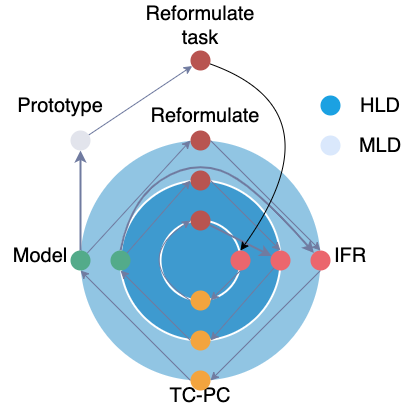

## 40 principles of invention. TCs.

1. [Original reference to 40 principles by Altshuller](https://altshuller.ru/triz/technique1.asp)
1. [40 INVENTIVE PRINCIPLES FOR SOLVING TECHNICAL CONTRADICTIONS](https://altshuller.ru/world/eng/technique1.asp)
1. [TRIZ 40 Design Principles](http://www.ipface.org/pdfs/reading/TRIZ_Principles.pdf)
1. [40 Inventive Principles With Examples](https://cdn2.hubspot.net/hubfs/2211211/PDF%20and%20Excel%20Downloads/triz_40_inventive_principles_with_examplesfeb15.pdf?__hstc=20830247.14dc1d91c03f5af4c552285b429ad2de.1657557714810.1657557714810.1657557714810.1&__hssc=20830247.1.1657557714811&__hsfp=372072412&hsCtaTracking=187d6c75-807f-47fe-900d-bcb39582bd90%7Cc1dbc2ef-7597-461e-8909-792eaeb00e7f)
1. [40 principles of invention table](https://en.wikipedia.org/wiki/TRIZ#/media/File:40_principles_of_TRIZ_method_720dpi.jpg)

### Principle 1. Segmentation 
**Separate the concerns**/
**Single-responsibility principle**

(model of 6: Divide and conquer)

1. Divide an object into independent parts
1. Make an object sectional - easy to assemble or disassemble
1. Increase the degree of fragmentation or segmentation

### Principle 5. Merging
**Single-responsibility principle**

(model of 6: Correlation)

1. Bring closer together (or merge) identical or similar objects or operations in space.
1. Make objects or operations contiguous or parallel; bring them together in time.

### Principle 7. Russian Dolls “Nested Doll”
**Encapsulation**/
**Single-responsibility principle**

1. Place one object inside another
1. Place multiple objects inside others
1. Make one part pass (dynamically) through a cavity in the other

### Principle 10. Preliminary Action
**Interface segregation principle**,
**Dependency inversion principle**

(model of 6: Planing, Logical reasoning)

1. Perform the required change of an object in advance.
1. Pre-arrange objects such that they can act from the most convenient place and without losing time for their delivery.

### Principle 11. Beforehand Cushioning
(model of 6: Planing)

1. Prepare emergency means beforehand to compensate for the relatively low reliability of an object (‘belt and braces’)

Examples: 

1. Back-up
1. Automatic save operations
1. Revision control
1. Testing 
1. RAID
1. Multi-channel control system
1. Air-bag in a car
1. Spare wheel 
1. Emergency lighting

### Principle 13. “The Other Way Round”
**Inverse dependency**

(model of 6: Reformulation, Reasoning by analogy**)

1. Invert the action used to solve the problem
1. Make movable parts (or the external environment) fixed, and fixed parts movable
1. Turn the object (or process) 'upside down'.

### Principle 20. Continuity of Useful Action.

1. Carry on work without a break. All parts of an object operating constantly at full capacity
1. Eliminate all idle or intermittent actions

Example: 

1. Booted notebooks use.
1. Use session instead of each request authorization. 

### Principle 22. Blessing in Disguise

(model of 6: Reformulation)

1. Use harmful factors (harmful effects of the environment) to achieve a positive effect

Examples:
1. Load testing
1. Use arctic cold to cool a data-center.

### Principle 23. Feedback

1. Introduce feedback to improve a process or action
1. If feedback is already used, update it

### Principle 24. Intermediary
**Interface segregation principle**,
**Dependency inversion principle**

Examples:

1. Proxy objects.

### Principle 25. Self-service

Examples:

1. Self-test. 
1. Auto-load.

### Principle 26. Copying
**Dependency inversion principle**

(model of 6: Reformulation, Simulation, Use external representations)

Examples:

1. Multiple data representation.
1. Computational models.

## Inventive Standards 
https://altshuller.ru/triz/standards.asp

https://altshuller.ru/world/eng/standards.asp

https://sites.google.com/site/otsmtriz/inventive-standards/class-1-1/group-1-1?authuser=0

### 1. Composition and Decomposition of S-Field systems

#### 1.1. Synthesis of S-Fields

https://altshuller.ru/triz/standards.asp#1

https://sites.google.com/site/otsmtriz/inventive-standards/class-1-1/group-1-1?authuser=0

Given an object S1 which is hard to control, 
and the conditions of the task do not contain any restrictions on the introduction of new substances and fields, 
the problem could be solved by synthesizing a new S-Field: 
the object is subjected to the action of a field via new substance S2 producing the necessary change over the object. 
The missing elements are introduced accordingly.

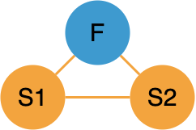

##### MVC

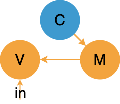

##### Pub-sub

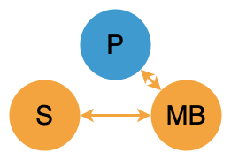

##### Visitor 

[Visitor Wikipedia page](https://en.wikipedia.org/wiki/Visitor_pattern)

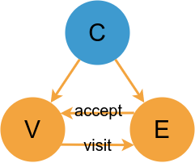

##### Oscillator motif
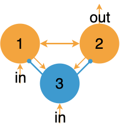

#### 1.2. Decomposition of S-Fields

If there are two influences useful and harmful between two substances, we could solve the problem adding the proxy substance.

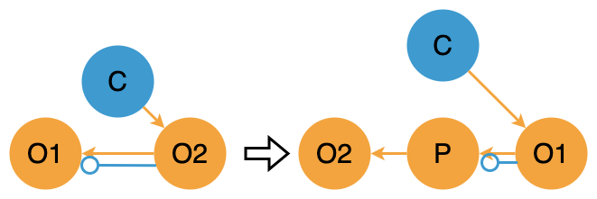

### 2. Evolution of S-Field systems

https://altshuller.ru/triz/standards.asp#2

https://sites.google.com/site/otsmtriz/inventive-standards/class-2?authuser=0

#### 2.1. A transition to integrate S-Fields

We can increase the efficiency of S-Fields using complex (chain, dual) S-Fields instead of simple ones.

#### 2.1.1. A transition to chain S-Field

https://www.ibm.com/cloud/architecture/architectures/event-driven-cqrs-pattern/

##### CQRS

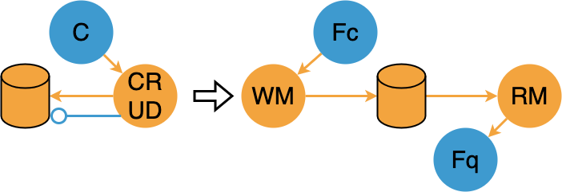

##### ResNet

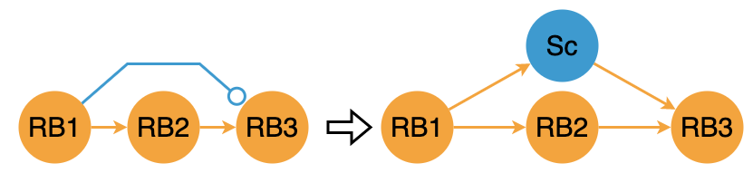

##### Chain of responsibility 

[Chain of responsibility wiki](https://en.wikipedia.org/wiki/Chain-of-responsibility_pattern)

#### 2.1.2. A transition to double S-Field

##### CQRS

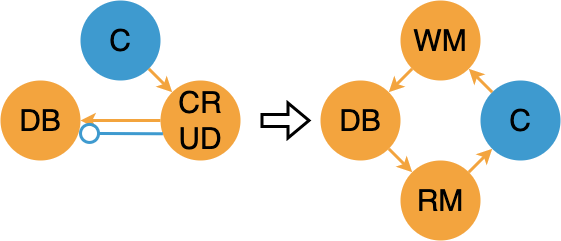

#### 2.2. Forcing S-Fields

To increase the effectiveness of S-Fields simple or complex we could enforce given S-Fields.

Ex: We could improve the effectiveness of S-Fields removing the unmanageable S-Field with good manageable S-Field, for example remove gravity S-Field with mechanical, mechanical with electrical etc.

#### 2.3. Evolution by Coordinating Rhythms

Instead of adding new substances and fields in this subclass we propose to use only quantitative changes of frequencies, sizes and mass, thus we could receive new significant effect with minimal changes.

#### 2.4. Complex-Forced S-Fields (F-Fields)

Enforcing of S-Fields could go with several standard ways. 
Most effectively we could enforce S-Fields with disperse ferromagnetic substance and magnetic field.

### 3. Transitions to Supersystem and Microlevel

In any stage of evolution the system could be merged with the other one or many in over-system with new properties. 

#### 3.1. Transitions to Bi-system and Poly-system

The effectiveness of the system could be improved using system transition 1-a: merging the system with the other one[many] in more complex bi-system or poly-system.

##### meristive CPG

Frontiers in neuroscience article https://www.frontiersin.org/articles/10.3389/fnins.2023.1124950/full

#### 3.2. Transition to Micro-level

The effectiveness of the system could be improved using the system transition 2: from the macro-level to micro-level: system or its part is removed with the substance that under the influence of the field is capable of implementing the requested task.

### 4. Measurement and Detection Standards

#### 4.1. Change Instead of Measurement and Detection

#### 4.2. Synthesis of Measuring Systems

#### 4.3. Forcing of measuring S-Fields

#### 4.4. Transition to Ferromagnetic Measurement Systems

#### 4.5. Evolution of Measuring Systems

### 5. Helpers (Standards on application on standards)

#### 5.1. Introduction of Substances under Restricted Conditions

#### 5.2. Introduction of Fields under Restricted Conditions

#### 5.3. Use of Phase Transitions

#### 5.4. Use of Physical Effects

#### 5.5. Experimental standards

# References 

## S-Fields

1. https://altshuller.ru/triz/triz8.asp

## ARIZ

1. https://altshuller.ru/triz/ariz85v-t2.asp

## Principles

1. [Original reference to 40 principles by Altshuller](https://altshuller.ru/triz/technique1.asp)
1. [40 INVENTIVE PRINCIPLES FOR SOLVING TECHNICAL CONTRADICTIONS](https://altshuller.ru/world/eng/technique1.asp)
1. [TRIZ 40 Design Principles](http://www.ipface.org/pdfs/reading/TRIZ_Principles.pdf)
1. [40 Inventive Principles With Examples](https://cdn2.hubspot.net/hubfs/2211211/PDF%20and%20Excel%20Downloads/triz_40_inventive_principles_with_examplesfeb15.pdf?__hstc=20830247.14dc1d91c03f5af4c552285b429ad2de.1657557714810.1657557714810.1657557714810.1&__hssc=20830247.1.1657557714811&__hsfp=372072412&hsCtaTracking=187d6c75-807f-47fe-900d-bcb39582bd90%7Cc1dbc2ef-7597-461e-8909-792eaeb00e7f)
1. [40 principles of invention table](https://en.wikipedia.org/wiki/TRIZ#/media/File:40_principles_of_TRIZ_method_720dpi.jpg)

## Standards 

1. https://en.wikipedia.org/wiki/Inventive_standard#cite_note-3 
1. https://altshuller.ru/world/eng/standards.asp
1. https://sites.google.com/site/otsmtriz/inventive-standards
1. https://www.ee.iitb.ac.in/~apte/CV_PRA_TRIZ_INTRO.htm
1. https://www.mindtools.com/pages/article/newCT_92.htm
1. https://www.triz.co.uk/innovation-materials-thank-you?submissionGuid=df6d37a6-ed17-4aa0-a1d5-dc5391179de2
1. https://cdn2.hubspot.net/hubfs/2211211/PDF%20and%20Excel%20Downloads/triz_40_inventive_principles_with_examplesfeb15.pdf?__hstc=20830247.14dc1d91c03f5af4c552285b429ad2de.1657557714810.1657557714810.1657557714810.1&__hssc=20830247.1.1657557714811&__hsfp=372072412&hsCtaTracking=187d6c75-807f-47fe-900d-bcb39582bd90%7Cc1dbc2ef-7597-461e-8909-792eaeb00e7f
1. https://www.quality-assurance-solutions.com/TRIZ-Separation-Principles.html
1. http://www.xtriz.com/publications/Souchkov_Roxas_SystemOfInventuiveBusinessStandardsTRIZfest%202016.pdf
1. https://www.aitriz.org/triz/triz-body-of-knowledge
1. https://www.mindtools.com/pages/article/newCT_92.htm
1. https://altshuller.ru/triz/standards.asp)

