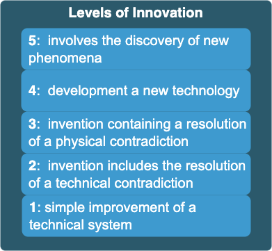
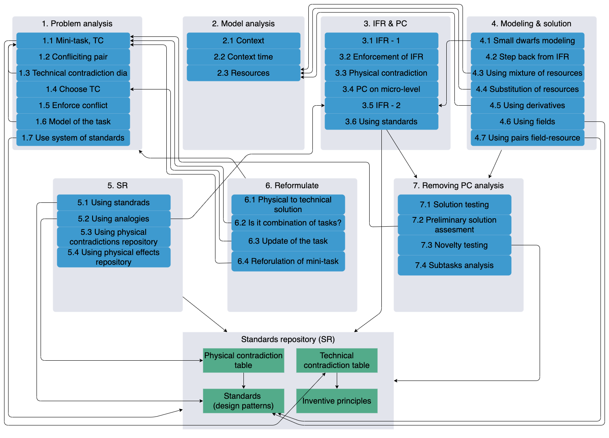
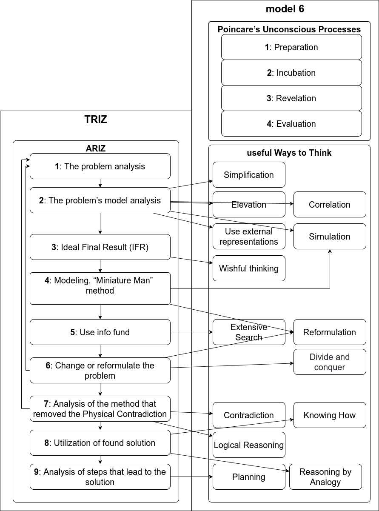

# Intro into TRIZ

## Useful references 
1. https://www.altshuller.ru/
1. https://en.wikipedia.org/wiki/TRIZ
1. https://aitriz.org/articles/40p_triz.pdf
1. http://websites.umich.edu/~scps/html/07chap/html/powerpointpicstriz/Chapter%207%20TRIZ.pdf
2. https://web.archive.org/web/20130410005442/http://www.triz-journal.com/archives/2002/03/b/index.htm

## Model of 6: ways to think

https://github.com/max-talanov/1/blob/master/affective_computing_course/levels_of_mental_activities.md

https://github.com/max-talanov/1/blob/master/affective_computing_course/thinking.md#useful-ways-to-think


## Poincare’s Unconscious Processes

https://web.media.mit.edu/~minsky/E7/eb7.html

1. **Preparation**: Activate resources to deal with this particular type of problem.
1. **Incubation**: generate many potential solutions.
1. **Revelation**: recognize a promising one.
1. **Evaluation**: verify that it actually works.

**Preparation**: To prepare to solve a specific problem, one first may need to ‘clear one’s mind’ from other goals— for example, by taking a walk, or by finding a quiet place to work. Then one must focus on the problem by deliberating to decide which of its features are central enough to suggest an appropriate Way to Think; here Poincare said, “All my efforts only served at first the better to show me the difficulty.”

**Incubation**: Once the ‘unconscious mind’ is prepared, it can consider large numbers of combinations, searching for ways to assemble those fragments to satisfy the required relations. Poincare wonders whether we do this with a very large but thoughtless search—or if it is done more cleverly.

**Revelation**: When should incubation end? Poincare suggests that it continues until some structure is formed "whose elements are so harmoniously disposed that the mind can embrace their totality while realizing the details." But how does that subliminal process know when it has found a promising prospect?

**Evaluation**: We often hear advice that suggests that it’s safer for us to trust our ‘intuitions—ideas that we get without knowing how. But Poincare went on to emphasize that one cannot always trust those ‘revelations.’

## Glossary 

1. **DPR** - Design Pattern Repository. In terms of ARIZ informfund or information fund.
1. **IFR** - Ideal Final Result the fictional result of development that could be the magical problem solution or customer satisfaction.
1. **TC** - Technical Contradiction The phase of the ARIZ where the engineer has to formalize the technical and of the problem.
1. **PC** - Physical Contradiction. The phase of the IM where the engineer has to formalize the physical contradiction of the problem.
1. **S-Field** the substance-field pair that is main building block of the TRIZ standards.

## TRIZ levels of innovation


1. **Simple improvement of a technical system** - well known object with no search for solutions.
1. **Invention includes the resolution of a technical contradiction** - there is the selection of new object from several similar or insignificant improvements were done to initial object.
1. **The invention containing a resolution of a physical contradiction** - the source object is significantly updated.
1. **The development a new technology** - a source object is completely updated.
1. **Involves the discovery of new phenomena** - a scientific discovery is made and the whole system where the object is included is updated.

## ARIZ
1. [Laws of TRIZ (original)](https://altshuller.ru/triz/zrts1.asp#tc23)
1. [TC table (original)](https://www.altshuller.ru/triz/technique2.asp)
1. [Principles of invention (original)](https://www.altshuller.ru/triz/technique1.asp)
1. [ARIZ (original)](https://www.altshuller.ru/triz/ariz85v.asp)
1. https://www.leaneast.com/wp-content/uploads/2020/04/TRIZ-Contradications-Matrix.png
1. https://triztrainer.ru/gsa/?i=24&d=33



### 1. The problem analysis
#### Step 1.1. Record mini-task (with no specific terms):
```
The system: for [the purpose of the system] including [list all main components of the system].
The technical contradiction 1 (TC-1): IF ..., Then ..., BUT ... 
The technical contradiction 2 (TC-2): IF ..., Then ..., BUT ... 
With minimal changes in the system we want to [identify the ideal final result (IFR)].
```

#### Step 1.2. Select and record conflicting pair: product and tool.

#### Step 1.3. Create diagrams of TC-1 and TC-2 using table 1.

1. [Table 1 (original)](https://www.altshuller.ru/triz/ariz85v-t1.asp)
1. [IM notation (reworked)](https://github.com/max-talanov/1/blob/master/Neurotechnologies_and_TRIZ/IM.md#im-notation)

#### Step 1.4. Select from TC-1 and TC-2 the one that matches better the main function of the system.

#### Step 1.6. Enforce the conflict indicating extreme state or action of elements.

#### Step 1.6. Record model of the task in the following form:

```
Conflicting pair;
Enforced conflict;
The function of introduced element for the task (what it should save, replace, enhance etc.)
```

#### Step 1.7. Check if there is an option to use the system of standards. If the task is still not solved move to the 2nd part of ARIZ. If the task is solved move to part 7 (2nd is still recommended).

1. [Contradiction matrix (original)](https://altshuller.ru/triz/technique2.asp)
1. [40 principles of invention (original)](https://altshuller.ru/triz/technique1.asp)
1. [40 principles of invention and contradiction matrix (en)](https://upload.wikimedia.org/wikipedia/commons/f/fa/1_Le_francais_-_40_principes_d%27invention%2C_2_L%27anglais_-_40_principles_of_invention%2C_3_L%27anglais_-_Contradiction_Matrix_in_TRIZ_method.pdf)

### 2. The problem's model analysis

#### Step 2.1. Identify spatial context. 

The contex of the problem, usually [context diagram](https://en.wikipedia.org/wiki/System_context_diagram).

#### Step 2.2. Identify temporal context.

#### Step 2.3. Identify S-Field resources.

Identify S-Field resources of the system its environment and product. Create a list of S-Field resources.

### 3. Ideal final result (IFR)

#### Step 3.1. Record IFR-1 in the form: 

```
The X-element without additional complications of the system preserving all the useful functions of the system 
removes: [harmful actions] 
in [the spatial context of the system]
during [the temporal context],
preserving the [useful action] of the tool.
```

#### Step 3.2. Enforce the IFR-1 with additional requirement: not to introduce new fields of substances.

#### Step 3.3. Record physical contradiction (PC) in the macro-level form:

```
The system in the [context]
must [indicate the physical macro-state, ex. "be hot"],
to implement [indicate one of the conflicting actions],
and must not [indicate opposite physical state, ex "be cold"],
to implement [indicate the other conflicting action].

```

#### Step 3.4. Record PC in micro-level (molecular) form.

#### Step 3.5. Record IFR-2: 

```
In the spatial context [indicate] 
during [indicate] 
must provide [indicate macro and micro states].
```

#### Step 3.6. Check the option to use the system of standards for the IFR-2. If the task is not solved move to the port 4 of ARIZ.

### 4. Modeling 

#### Step 4.1. Method of SHM.

```
a) using method of SHM ("small humans" modeling), create conflict schematic A;
b) update the schematic A, in the way the "small humans" do not cause the conflict;
c) move to the technical schematic.
```

#### Step 4.2. If we know how the final system should look like and we have to understand the method to produce the final system we could use method "step back from IFR". We draw the final system and introduce the minimal destructing update.

#### Step 4.3. Identify if the task could be solved using merging of S-Fields.

#### Step 4.4. Identify if the task could be solved using void or mixture of S-Fields and void.

#### Step 4.5. Identify if the task could be solved using derivatives from the current S-Fields and their mixture with void.

#### Step 4.6. Identify if the task could be solved using fields instead of substances.

#### Step 4.7. Identify if the task could be solved using pair "field - additional substance reacting with the field" (ex. magnetic field - ferromagnetic, ultraviolet radiation - luminophore, infrared field - metal with memory etc.)

### 5. Patent search

#### Step 5.1. Identify if the task as IFR-2 could be solved using standards.

1. [List of inventive standards (original)](https://altshuller.ru/triz/standards.asp)
1. [List of inventive standards (en)](https://github.com/max-talanov/1/blob/master/Neurotechnologies_and_TRIZ/IM.md#inventive-standards)

#### ШАГ 5.2. Identify if the task as IFR-2 could be solved by analogy with non-standard tasks earlier solved using ARIZ.

#### ШАГ 5.3. Identify if the task as IFR-2 could be solved using table of physical contradictions (PC) 

1. [Table of PCs (original)](https://altshuller.ru/triz/ariz85v-t2.asp)
1. [Table of PCs (en)](https://github.com/max-talanov/1/blob/master/Neurotechnologies_and_TRIZ/IM.md#physical-contradiction-using-standards-design-patterns)

...

### 6. Change or reformulate the problem

#### Step 6.1. If the task is solved move from physical to technical solution: define the method and provide principal schematic of the solution.

#### Step 6.2. If the task is not solved check if the 1.1 is combination of several tasks. In this case decompose the task into several and solve tasks separately.

#### Step 6.3. If the task is not solved select the other TC in the step 1.4.

#### Step 6.4. If the task is not solved get back to the step 1.1 and reformulate the task addressing the super-system. We can use this method several times.

### 7. Analysis of the method that removed the Physical Contradiction

...

#### Step 7.2. Preliminary validation of the solution.

```
Key questions: 

a) Does the solution provide the main requirement of the IFR-1 (Element by itself)?
b) What PC was removed (if it was) by the solution?
c) Does the system contain at least one well controlled element? What exactly element? What is the method to control the element?
d) Can we use the system with one cycle for several cycles?
```

#### Step 7.3. Check according to the patents DB novelty of the solution.

#### Step 7.4. Decompose the task into sub-tasks list (inventive, design, computational, organizational).

### 8. Utilization of the found solution

#### Step 8.1. Identify the list of changes of the super-system of the system with the solved task.

#### Step 8.2. Check if the new system or super-system could be used in a new way.

#### Step 8.3. Use the received answer to solve other problems:
```
a) define generalized form of the received principle;
b) identify if there is an option to use the new principle in strait-forward way;
c) identify if there is an option to use the new principle in reverse way;
d) create morphological table: "position of components - states of the system", "used fields - sates of the environment";
e) review the scaling problems of the found principle.
```

### 9. Analysis of method that lead to the solution

#### Step 9.1. Compare the workflow of the solution of the task with ARIZ.
...

## ARIZ to Software Development process mapping
[Innovation methodology](IM.md)


## ARIZ to model of 6 mapping 


## Spiral development


## References 
http://www.ipface.org/pdfs/reading/TRIZ_Principles.pdf

#### In short 
https://timeweb.com/ru/community/articles/metod-triz-chto-eto-takoe-i-kak-rabotaet

#### In English
https://www.toolshero.com/problem-solving/triz-method/
