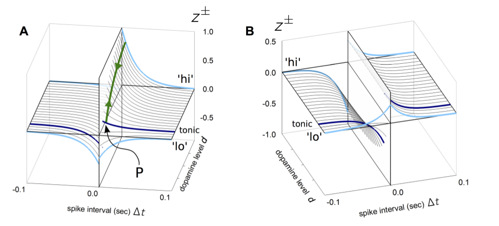

# Neuromodulation

In case neurotransmitter lives the synaptic cleft and avoids degradation it massively influences neurons (even brain areas) on it's pathway.

### DA

### 5-HT
[5-HT receptors](https://en.wikipedia.org/wiki/5-HT_receptor)

### Dopamine and Serotonin pathways

### Major neuromodulation systems

[Major neurotransmitter systems](http://en.wikipedia.org/wiki/Neuromodulation#The_major_neurotransmitter_systems)

name          |origin          |target                                                                 |effects
:-------------|----------------|-----------------------------------------------------------------------|--------
noradrenaline |locus coeruleus |adrenergic receptors in striatum, neocortex, hippocampus, amygdala ...|arousal, reward system 
serotonin     |raphe nucleus   |serotonin receptors in deep cerebellar nuclei, cerebellar cortex      |increase (introversion), mood, satiety, body temperature and sleep, while decreasing nociception
dopamine      |dopamine pathways |dopamine receptors at pathway terminations| motor system, reward system, cognition, endocrine, nausea

### VTA

"the VTA, in particular the VTA dopamine neurons, serve several functions in the reward system, motivation, cognition, drug addiction, and may be the focus of several psychiatric disorders. It has also been shown to process various types of emotion output from the amygdala, where it may also play a role in avoidance and fear-conditioning. Electrophysiological recordings have demonstrated that VTA neurons respond to novel stimuli, unexpected rewards, and reward-predictive sensory cues. The firing pattern of these cells is consistent with the encoding of a reward expectancy error. In 2006 MRI Studies by Helen Fisher and her research team found and documented various emotional states relating to intense love correlated with activity in the VTA, which may help explain obsessive behaviors of rejected partners since this is shared by the reward system."

### Substantia nigra

"The substantia nigra is an important player in brain function, in particular, in eye movement, motor planning, reward-seeking, learning, and addiction. Many of the substantia nigra's effects are mediated through the striatum. The nigral dopaminergic input to the striatum via the nigrostriatal pathway is intimately linked with the striatum's function. The co-dependence between the striatum and substantia nigra can be seen in this way: when the substantia nigra is electrically stimulated, no movement occurs; however, the symptoms of nigral degeneration due to Parkinson's is a poignant example of the substantia nigra's influence on movement. In addition to striatum-mediated functions, the substantia nigra also serves as a major source of GABAergic inhibition to various brain targets."

### Raphe nuclei

"The raphe nuclei have a vast impact upon the central nervous system. Many of the neurons in the nuclei (but not the majority) are serotonergic; i.e., contain serotonin, a type of monoamine neurotransmitter and are modulated through fibrous pathways in the midbrain.
Projections from the raphe nuclei also terminate in the dorsal horn of spinal grey matter where they regulate the release of enkephalins, which inhibit pain sensation."

### Nucleus accumbens

"... it plays an equal role in processing many rewards such as food and sex. The nucleus accumbens is selectively activated during the perception of pleasant, emotionally arousing pictures and during mental imagery of pleasant, emotional scenes.[Costa et al, Sabatinelli et al] ...  The nucleus accumbens plays a role in rhythmic timing and is considered to be of central importance to the limbic-motor interface (Mogensen).
... the area is the "pleasure center" of the brain and is involved in reinforcement learning.[Olds J, Milner] In rats, stimulation of the ventral tegmental area causes the release of dopamine in the nucleus accumbens much in the same way as addictive drugs and natural reinforcers, such as water or food, initiate the release of dopamine in the nucleus accumbens.[Nakahara] The same results have been seen in human subjects in functional imaging studies."

### Striatum

"Metabotropic dopamine receptors are present both on spiny neurons and on cortical axon terminals. Second messenger cascades triggered by activation of these dopamine receptors can modulate pre- and postsynaptic function, both in the short term and in the long term. The striatum is best known for its role in the planning and modulation of movement pathways but is also potentially involved in a variety of other cognitive processes involving executive function, such as working memory. In humans, the striatum is activated by stimuli associated with reward, but also by aversive, novel, unexpected, or intense stimuli, and cues associated with such events."

### Hippocampus

"Psychologists and neuroscientists generally agree that the hippocampus plays an important role in the formation of new memories about experienced events (episodic or autobiographical memory). Part of this function is hippocampal involvement in the detection of novel events, places and stimuli. Some researchers regard the hippocampus as part of a larger medial temporal lobe memory system responsible for general declarative memory (memories that can be explicitly verbalized—these would include, for example, memory for facts in addition to episodic memory)."

"Studies conducted on freely moving rats and mice have shown that many hippocampal neurons have "place fields", that is, they fire bursts of action potentials when a rat passes through a particular part of the environment."

### Frontal cortex

"The executive function of the frontal lobes involves the ability to recognize future consequences resulting from current actions, to choose between good and bad actions (or better and best), override and suppress socially unacceptable responses, and determine similarities and differences between things or events.
The frontal lobes also play an important part in retaining longer-term memories which are not task-based. These are often memories associated with emotions derived from input from the brain's limbic system. The frontal lobe modifies those emotions to generally fit socially acceptable norms."

## Role of Noradrenaline, Dopamine and  Serotonin

### Emotional loop

Connectivity diagram showing excitatory glutamatergic pathways as red, inhibitory GABAergic pathways as blue, and modulatory dopaminergic pathways as magenta. (Abbreviations: GPe: globus pallidus external; GPi: globus pallidus internal; STN: subthalamic nucleus; SNc: substantia nigra compacta; SNr: substantia nigra reticulata)

#### Direct pathway

**Cortex** (stimulates) → **Striatum** (inhibits) → **"SNr-GPi" complex** (less inhibition of thalamus) → **Thalamus** (stimulates) → **Cortex** (stimulates) → **Muscles, etc.**

#### Indirect pathway

**Cortex** (stimulates) → **Striatum** (inhibits) → **GPe** (less inhibition of STN) → **STN** (stimulates) → **"SNr-GPi" complex** (inhibits) → **Thalamus** (is stimulating less) → **Cortex** (is stimulating less) → Muscles, etc.

The antagonistic functions of the direct and indirect pathways are modulated by the **substantia nigra pars compacta (SNc)**, which produces **dopamine**. In the presence of dopamine, D1-receptors in the basal ganglia stimulate the GABAergic neurons, favoring the direct pathway, and thus increasing movement. The GABAergic neurons of the indirect pathway are stimulated by excitatory neurotransmitters acetylcholine and glutamate. This sets off the indirect pathway that ultimately results in inhibition of upper motor neurons and less movement. In the presence of dopamine, D2-receptors in the basal ganglia inhibit these GABAergic neurons, which reduces the indirect pathways inhibitory effect. **Dopamine therefore increases the excitatory effect of the direct pathway (causing movement) and reduces the inhibitory effect of the indirect pathway (preventing full inhibition of movement)**. 

## Homeostasis

Role of affects and emotions in homeostasis and emotional regulation.

Marvin Minsky's brain bug.

## Functional brain zones

### Brodmann areas

## References

1. [Neurotransmitter Wikipedia page](http://en.wikipedia.org/wiki/Neurotransmitter)
1. [Neurotransmission Wikipedia page](http://en.wikipedia.org/wiki/Neurotransmission)
1. [Neuromodulation Wikipedia page](http://en.wikipedia.org/wiki/Neurotransmission)
1. [Metabotropic vs ionotropic receptors](http://www.interactive-biology.com/3974/ionotropic-vs-metabotropic-receptors/)
1. [Metabotropic receptor Wikipedia page](http://en.wikipedia.org/wiki/Metabotropic_receptor)
1. [Ionotropic receptor Wikipedia page](http://en.wikipedia.org/wiki/Ionotropic)
1. [Mesocortical pathway Wikipedia page](http://en.wikipedia.org/wiki/Mesocortical_pathway)
1. [Mesolimbic pathway Wikipedia page](http://en.wikipedia.org/wiki/Mesolimbic_pathway)
1. [Nigrostriatal pathway Wikipedia page](http://en.wikipedia.org/wiki/Nigrostriatal_pathway)
1. [VTA Wikipedia page](http://en.wikipedia.org/wiki/Ventral_tegmentum)
1. [Raphe nuclei Wikipedia page](http://en.wikipedia.org/wiki/Raphe_nuclei)
1. [Substantia nigra Wikipedia page](http://en.wikipedia.org/wiki/Substantia_nigra)
1. [Striatum Wikipedia page](http://en.wikipedia.org/wiki/Striatum)
1. [Hippocampus Wikipedia page](http://en.wikipedia.org/wiki/Hippocampus)
1. [Frontal cortex Wikipedia page](http://en.wikipedia.org/wiki/Frontal_cortex)
1. [Lovheim, Cube of emotions, Wikipedia page](http://en.wikipedia.org/wiki/L%C3%B6vheim_cube_of_emotion)
1. Costa, VD, Lang, PJ, Sabatinelli, D, Bradley MM, and Versace, F (2010). "Emotional imagery: Assessing pleasure and arousal in the brain's reward circuitry". Human Brain Mapping 31 (9): 1446–1457. doi:10.1002/hbm.20948. PMID 20127869.
1. Sabatinelli, D, Lang, PJ, Bradley, MM, Costa, VD, and Versace, F (2007). "Pleasure rather than salience activates human nucleus accumbens and medial prefrontal cortex". Journal of Neurophysiology 98 (9): 1374–1379. doi:10.1152/jn.00230.2007. PMID 17596422.
1. [Olds J, Milner P (1954). "Positive reinforcement produced by electrical stimulation of septal area and other regions of rat brain". J Comp Physiol Psychol 47 (6): 419–27. doi:10.1037/h0058775. PMID 13233369.](http://wadsworth.cengage.com/psychology_d/templates/student_resources/0155060678_rathus/ps/ps02.html)
1. Nakahara, D., Ozaki, N., Miura, Y., Miura, H., et al. Increased dopamine and serotonin metabolism in rat nucleus accumbens produced by intracranial sel-stimulation of medial forebrain bundle as measured by in vivo microdialysis. Brain Research', 1989 495: 178-181.
1. Gurney, K. N., Humphries, M. D., & Redgrave, P. (2015). A New Framework for Cortico-Striatal Plasticity: Behavioural Theory Meets In Vitro Data at the Reinforcement-Action Interface. PLoS Biology, 13(1), e1002034. https://doi.org/10.1371/journal.pbio.1002034
1. Frontiers | The role of the serotonin receptor subtypes 5-HT1A and 5-HT7 and its interaction in emotional learning and memory | Pharmacology. (n.d.). Retrieved October 3, 2018, from https://www.frontiersin.org/articles/10.3389/fphar.2015.00162/full
1. Balaban PM, Vinarskaya AK, Zuzina AB, Ierusalimsky VN, Malyshev AY.
Impairment of the serotonergic neurons underlying reinforcement elicits extinction of the repeatedly reactivated context memory.
Sci Rep. 2016 Nov 14;6:36933. doi: 10.1038/srep36933
1. https://mammalcedfx.pathwaystudio.com/app/sd?full=true&layout=flat&entitylist=HTR1a#
