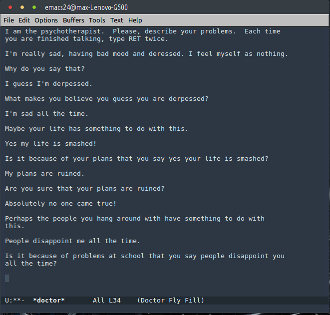

# Intelligent agents

## Turing test

[Turing test Wikipedia](https://en.wikipedia.org/wiki/Turing_test)

## Peter Norvig and Stuart Russel classification

1. Simple reflex agents
1. Model-based reflex agents
1. Goal-based agents
1. Utility-based agents
1. Learning agents

### Simple reflex agents

### Model-based reflex agents

### Goal-based agents

### Utility-based agents

### Learning agents

## Cognitive architectures 

### H-CogAff by [Aaron Sloman](https://www.cs.bham.ac.uk//~axs/)

[H-CogAff architecture](https://www.cs.bham.ac.uk/research/projects/cogaff/)

### Model of six by Marvin Minsky

* **Inborn, Instinctive Reactions**: Joan hears a sound and turns her head. We are born with instincts that help us to survive.
* **Learned Reactions**: She sees a quickly oncoming car. Joan had to learn that certain conditions demand specific ways to react.
* **Deliberative Thinking**: What to say at the meeting. Joan considers several alternatives and tries to decide which would be best.
* **Reflective Thinking**: Joan reflects on her decision. Here she reacts not to external events but happenings inside her brain.
* **Self-Reflective Thinking**: Uneasy about arriving late. Here we find her thinking about plans that she has made for herself.
* **Self-Conscious Emotions**: What would my friends have thought of me? Here Joan asks how well her actions agreed with her ideals.

## Examples

### Eliza

https://en.wikipedia.org/wiki/ELIZA

### Dialog agents

[Component diagram](https://github.com/tu-team/2/blob/master/doc/informal/annotation-interpretation-validation.md)

### Eugene Goostman

https://en.wikipedia.org/wiki/Eugene_Goostman

### IBM Watson

https://en.wikipedia.org/wiki/Watson_(computer)

