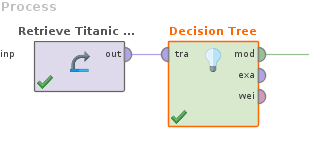
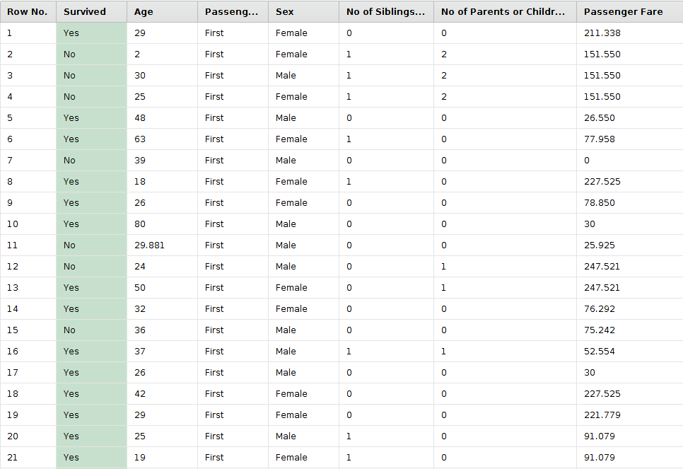
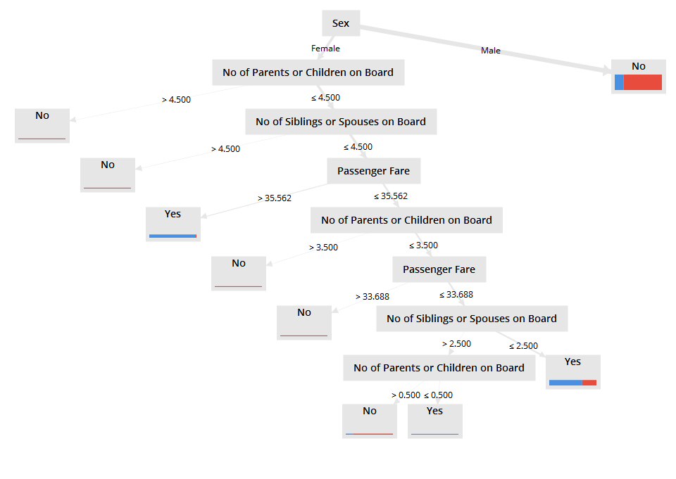
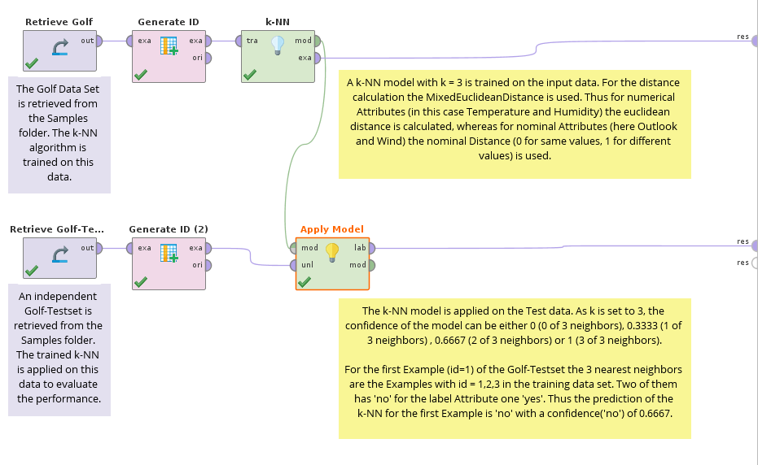
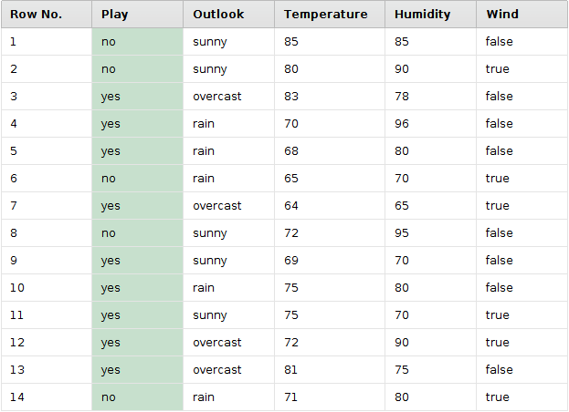
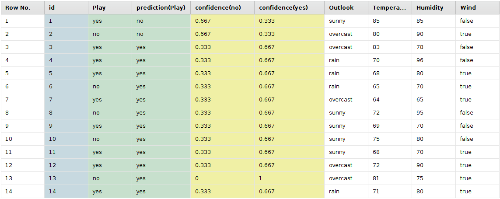
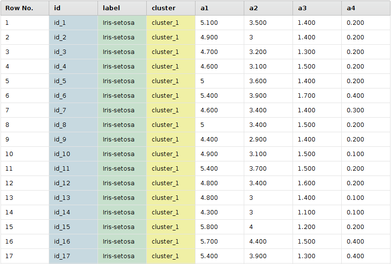
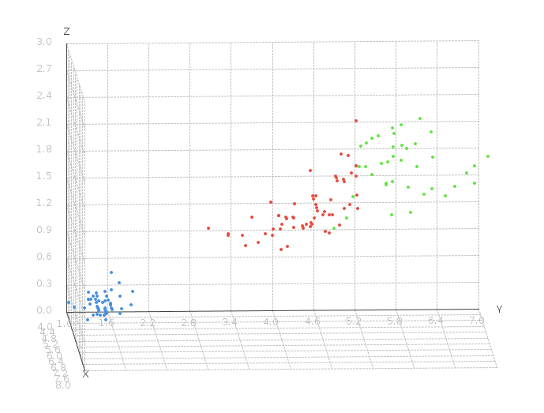

# Machine learning intro

# What is machine learning?

# Types of machine learning

1. Supervised learning 
1. Unsupervised learning
1. Reinforcement 

# Supervised or learning with teacher

Input parameters vector and class to be classified.

# Unsupervised learning without teacher

## kNN

[Nearest neighbor search Wikipedia page](https://en.wikipedia.org/wiki/Nearest_neighbor_search)

## k means 

 

# Reinforcement learning

1. [RL intro presentation](https://courses.cs.washington.edu/courses/cse490r/19sp/site/resources/lec28_rl.pdf)
1. [RL nice intro](https://www.freecodecamp.org/news/a-brief-introduction-to-reinforcement-learning-7799af5840db/)
1. [Wikipedia page](https://en.wikipedia.org/wiki/Reinforcement_learning)

An agent takes actions in an environment, which is interpreted into a reward and a representation of the state, which are fed back into the agent.

# Perceptron 

# F measure

[Wikipedia page](https://en.wikipedia.org/wiki/F1_score)

# 10 fold

