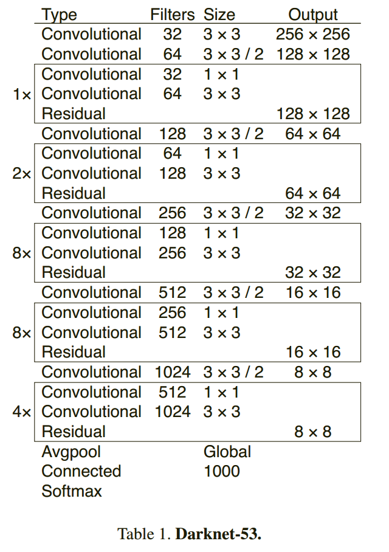
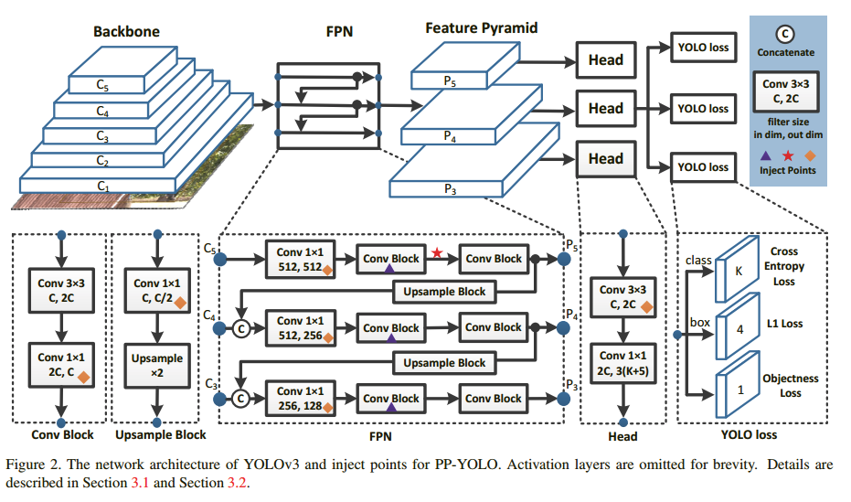
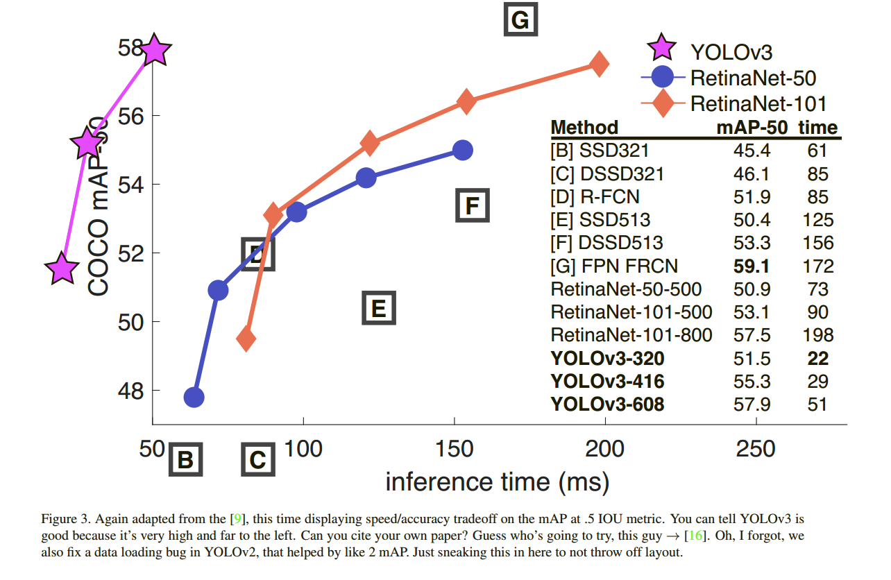

# YOLO (You only look once)

## YOLOv3

### YOLOv3-tiny

### YOLOv3-SPP

### Algorithm 

**Pr(Classi|Object)∗Pr(Object)∗IOU = Pr(Classi)∗IOU**

### Architecture

### Benchmarks

## YOLOv5

### Benchmarks 

| Model | APval | APtest | AP50 | SpeedGPU | FPSGPU || params | FLOPS |
|---------- |------ |------ |------ | -------- | ------| ------ |------  |  :------: |
| [YOLOv5s](https://github.com/ultralytics/yolov5/releases/tag/v3.0)    | 37.0     | 37.0     | 56.2     | **2.4ms** | **416** || 7.5M   | 13.2B
| [YOLOv5m](https://github.com/ultralytics/yolov5/releases/tag/v3.0)    | 44.3     | 44.3     | 63.2     | 3.4ms     | 294     || 21.8M  | 39.4B
| [YOLOv5l](https://github.com/ultralytics/yolov5/releases/tag/v3.0)    | 47.7     | 47.7     | 66.5     | 4.4ms     | 227     || 47.8M  | 88.1B
| [YOLOv5x](https://github.com/ultralytics/yolov5/releases/tag/v3.0)    | **49.2** | **49.2** | **67.7** | 6.9ms     | 145     || 89.0M  | 166.4B
| | | | | | || |
| [YOLOv5x](https://github.com/ultralytics/yolov5/releases/tag/v3.0) + TTA|**50.8**| **50.8** | **68.9** | 25.5ms    | 39      || 89.0M  | 354.3B
| | | | | | || |
| [YOLOv3-SPP](https://github.com/ultralytics/yolov5/releases/tag/v3.0) | 45.6     | 45.5     | 65.2     | 4.5ms     | 222     || 63.0M  | 118.0B

### Our benchmarks

| model       | tea        | coffee | pampers | extra | duration | jacket| banana | tomato | extra | duration |**Recall**    |**Precision**|
|-------------|------------|--------|---------|-------|----------|-------|--------|--------|-------|----------|--------------|-------------|
| yolov5l     | 0          | 1      | 0       | 1     | 2.382    | 1     | 1      | 1      | 0     | 2.202    | 0.666 	     | 0.8         |
| yolov5m     | 0          | 0      | 0       | 2     | 1.44     | 1     | 1      | 1      | 0     | 1.351    | 0.5          | 0.6         |
| yolov5s     | 1          | 1      | 1       | 1     | 0.589    | 1     | 1      | 1      | 5     | 0.515    | 1            | 0.5         |
| yolov5x     | 0          | 1      | 1       | 1     | 4.173    | 1     | 1      | 1      | 0     | 4.041    | 0.833 	     | 0.833       |
| yolov3-spp  | 0          | 1      | 0       | 4     | 2.73     | 0     | 1      | 1      | 1     | 2.992    | 0.5          | 0.375       |
| yolov5l-fpn | 0          | 1      | 0       | 2     | 2.19     | 1     | 1      | 1      | 2     | 2.433    | 0.666 	     | 0.5         |
| yolov5m-fpn | 0          | 1      | 0       | 2     | 1.195    | 0     | 1      | 1      | 0     | 1.086    | 0.5          | 0.6         |
| yolov5s-fpn | 0          | 1      | 1       | 2     | 0.522    | 1     | 1      | 1      | 3     | 0.492    | 0.833 	     | 0.5         |
| yolov5x-fpn | 0          | 1      | 0       | 4     | 3.688    | 1     | 1      | 1      | 0     | 3.721    | 0.666 	     | 0.5         |

[YOLO models comparison](https://docs.google.com/spreadsheets/d/1lnaxeeLlomnvtsInAsOQagFE5PSgD15blBKOq6w3fbY/edit#gid=0)

## References

1. [darknet YOLO](https://pjreddie.com/darknet/yolo/)
1. [YOLOv3 github](https://github.com/ultralytics/yolov3)
1. [YOLOv5 github](https://github.com/ultralytics/yolov5)
1. [YOLOv3: An Incremental Improvement](https://arxiv.org/pdf/1804.02767.pdf)
1. [YOLOv4](https://arxiv.org/pdf/2004.10934.pdf)
1. [Tiny-YOLO](https://arxiv.org/pdf/2008.02170.pdf)
1. [PP-YOLO](https://arxiv.org/pdf/2007.12099.pdf)
1. [Object Detection and Tracking Algorithms for Vehicle Counting](https://arxiv.org/pdf/2007.16198.pdf)
