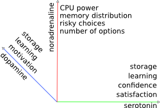

# Computational emotional thinking model

## Introduction

Emotions are in focus of a lot of researchers from neuro-scientists [emotionsbraintorobot, parsingreward, neuromodulatory, cubeofemotions, natureofemotions], to computer science specialists[emotionandsociable, senticcomputing, hourglass, affectivemodelofinterplay, affectivecomputing], and emotional intelligence(EQ) becomes important, at least not less than IQ.
There were only some computational emotions models created[computationalmodelsemotion, computationalmodelsemotionscognition, evaluatingcomutationalmodel, threelevel] and we failed to find computational emotion thinking model already created.

Marvin Minsky in his book "The emotion machine"[emotionmachine] described human thinking model, and proposed promising base and framework for emotional thinking implementation in computing system. He demonstrated that emotions are inseparable parts of thinking. There are several number of researchers that share this point of view on emotions. Rosalind Picard in her article[affectivecomputingchallanges] "Challenges of affective programming" states: "Although people are the most intelligent systems we know, and people’s emotion appears to play a vital role in regulating and guiding intelligence, it does not mean there might not be a better way to implement some of these goals in machines. It may be possible that there is something like the wheel, which has no precise human or animal equivalent, but which provides for some of the same locomotion goals. There may exist a kind of alien intelligent living system, something we’ve never encountered, which achieves its intelligence without having anything like emotion.". It was demonstrated that emotions plays vital role in learning and decision making [roleofemotions]. Robert Plutchik in his article "The nature of emotions" [natureofemotions] states that emotions evolved through years and became important part of cognitions, behavior and mind - "What we call cognition - the activity of knowing, learning and thinking, of which emotion is a part—evolved over millions of years. Charles Darwin recognized that the process of evolution by natural selection applied not only to anatomic structures but also to an animal’s "mind" and expressive behavior-a conclusion that led him to write a book on emotional expression.". Hence there is no example of unemotional intelligence and emotions are inseparable part of thinking we face the problem of emotional thinking model implementation as soon as we attempt to construct more or less comparable to human intelligence. This is interdisciplinary work that we have ran to create theoretical basis for computational emotional thinking to be used further for modelling and implementing as code and possible embodiment in social robot. There could be selected several domains for future use:

1. Computer - human social collaboration
1. Human emotional behavior assessment
1. Computer games and simulations
1. Automation of primitive service tasks
1. Nursing

We demonstrate below framework based on synthesis of AI, psychology and neuro-science theories and frameworks of emotions. We propose mapping and influence mechanism of neurotransmitters to computing system management parameters.

## Emotional thinking model

### Model basis

#### Minsky's Thinking model

First basis that is used in this work is  AI. We used Marvin Minsky emotional thinking approach.
Marvin Minsky in his book "The emotion machine"[emotionmachine] described human thinking model. Main structural idea that we used and adopted is "Model of six".

Model of six thinking levels:

1. Instinctive reactions
1. Learned reactions
1. Deliberative
1. Reflective thinking
1. Self-reflective thinking
1. Self-conscious reflections

All thinking processes are developed in levels listed above. We use following assumption: emotions as part of thinking, at least conscious processes, should fit thinking model. This way all emotional processed should be expressed in terms of thinking model(levels). This could be understood as base of computational emotional thinking approach.

#### Evolutionary psychology

The other perspective is psychology.  We use Plutchik approach[natureofemotions] as main psychological model. Plutchik indicated 8 basic emotions grouped in 4 pairs:

1. Joy - sorrow
1. Anger - fear
1. Acceptance - disgust
1. Surprise - expectancy

Emotions are organised in three dimensional circumplex model where third dimension is emotional strength. Basic emotions could be mixed based on color theory, in higher more complex emotions. Complex emotions mixtures of two basics are called "primary dyads":

1. Love
1. Submission
1. Awe
1. Disapproval
1. Remorse
1. Contempt
1. Aggressiveness
1. Optimism

More complex emotions based on three could be combined in similar way, see Cambria [senticcomputing].
Cambria [hourglass] used Gauss function to describe passage from one sentic level to another. We interpreted it as: Gaussian function regulates influence of subjective human perception of inbound stimulus over objective brain response. Semir Zeki[neuralcorrelatesofhate] describes to emotion(hate) correlation to neural activities as Gaussian.

#### Neuromodulation and neurotransmission theory

Third basis of emotional thinking model is neuroscience. Objective brain work is described as neuromodulation process in [neuromodulatory] and [emotionsbraintorobot] with base of four neuromodulatory systems:

1. Dopamine
1. Serotonin
1. Opioids

Close to their work is model based on monoamine neurotransmitters called "Cube of emotions" of Hugo Lövheim[cubeofemotions].
Author describes emotions and correlation to neurotransmitters concentration. Using three main neurotransmitters:

1. Nor-adrenaline
1. Dopamine
1. Serotonin

Lövheim uses three dimensional model-cube and assumes that all emotional states could be placed in the three dimensional cube with neurotransmitters as axes and eight basic emotions ordered in an orthogonal coordinate system that are affective states. Affective states are inherited from affect theory of Tomkins [tomkins1, tomkins2, tomkins3, tomkins4]:

 1. Enjoyment/Joy
 1. Interest/Excitement
 1. Surprise
 1. Anger/Rage
 1. Disgust
 1. Distress/Anguish
 1. Fear/Terror
 1. Shame/Humiliation

This group of affects does match the basic Plutchik's emotions except for humiliation that could be interpreted as contempt. Complete mapping description is presented below.

According to [emotionsbraintorobot] there are four following neuronal systems involved in to emotional processing:

1. Spinal cord
1. Hypothalamus
1. Amygdala
1. Frontal cortex, cingulate cortex

We correspond spinal cord, hypothalamus and amygdala with instinctive layer of Minsky's thinking model. This mapping is done in the assumption that reflexes, drives and instincts could be placed in instinctive reactions layer responsible for most primitive actions that do not involve conscious reactions or more complex processes like learned reactions or deliberations. Cognitions are could be placed in 5 higher layers that corresponds to working memory and all conscious actions in emotional processing/thinking.

### Emotions in six thinking levels

This is attempt to synthesize theory based on three approaches. First of all we described Plutchik's feedback loops[natureofemotions] in Minsky's six thinking levels.

Figure 1. [Emotions in model of six thinking levels].

1. Inbound stimulus is been processed(transmitted/apprised) via spinal cord, hypothalamus, amygdathis modella and all these neuronal systems take part in neuromodulation.
1. Neuromodulation actually triggers the emotional state of human and all the rest actions are done under the influence of neuromodulatory systems: nor-adrenaline, dopamine, serotonin. 
1. Instinctive behavior is processed on instinctive reactions layer that usually is not involved in conscious actions.
1. Result of behavior actions is effect state that influences the system again as stimulus. This second stimulus is been apprised on instinctive reactions layer and triggers neuromodulation again. Neuromodulation in it's turn switches emotional state second time. This way stimulus cognition actions started in first emotional state, at some point could continue in second emotional state.
1. Stimulus cognition is processed in cingulate cortex, frontal cortex (working memory) that we correspond to rest 5 layers of thinking model. Stimulus cognition actions is done in the emotional state under influence of neuromodulation. Stimulus cognition could involve deliberation, further reflection, sef-reflection self-conscious processing (higher emotions) and  emotional state switch.
1. Conscious behavior is activated as the result of stimulus cognition.

#### Stimulus appraisal and stimulus cognition

There are two main ways of inbound stimulus processing: appraisal is done on the instinctive reactions level and usually is processed as non-conscious action, cognition could involve all the rest thinking levels and could consist of complex deliberations and reflections.
Cognitions also include self-conscious reflections over complex emotions like love, awe and aggression. For example startle is been apprised on instinctive reactions layer (spinal cord, hypothalamus, amygdala) where non-conscious decision is made and instinctive behaviour is chosen (it could be even reflex). In case of startle this could be run or jump aside. Only after those instinctive actions are performed human could realise what had happen to him (in the state of effect). In contrast to appraisal cognitions could are performed on higher levels could take some significant time and could include complex reasoning and reflections. For example fear could be triggered not only by inbound stimulus but by long time perception during some horror movie or deliberation over some facts regarding the world. In contrast to startle fear triggers complex conscious behaviour that could in it's turn become panic and trigger less intelligent behaviour like shouting and running from side to side. Both instinctive and conscious behaviour produces effect state. Effect is an environmental state that was altered from previous state via behaviour. Running in case of startle places human in safe place that produces effect which influence stimulus event and it's appraisal and as consequence emotional/affective state.

#### Feeling the state and neuromodulation

Feeling the emotional state is closely related to neuromodulation the physiological arousal processes in brain. The result of stimulus appraisal is subjective emotional state one of 8 basic Plutchik emotions that are used as dimensions and strength of emotion. This way subjective emotional state is been expressed via two coordinates: emotional state nature and strength of emotion. Emotional state nature and emotional strength are in range from 0 to 1. Subjective strength of emotion corresponds to objective brain activities via Gaussian function see [hourglass]. Objective brain activities are expressed via neuromodulation, see [emotionsbraintorobot] that is expressed in terms of neurotransmitters concentration. Neurotransmitters  concentration is expressed in range from 0 to 1 in cube of emotions, see Lövheim[cubeofemotions]. This way inbound stimulus is been apprised and triggers subjective emotional state switch and then objective brain functions as result of neurotransmitters concentration variation. For example the system is scared. System switched it's state to terror with maximum strength 1. This subjective terror strength is mapped to objective dopamine(neurotransmitter) concentration, in our case this is maximum 1. Under the influence of maximum concentration of dopamine all further actions is been performed: decisions over instinctive behavior, stimulus cognitions, selection of conscious behavior. All higher thinking processes control and influence lower actions. For example: if human is scared during watching the film he/she usually does not jump and run away. Some kind of reflection(reflection thinking level) is used: "This is just a movie, nothing terrible is going to happen to me". This is done by switching emotional state on reflection thinking level.

#### Neuromodulation to computing system management mapping

All that was presented above was the description of human thinking process and human emotions in terms of it. Only one reference to AI was done to Marvin Minsky "The emotion machine" [emotionmachine]. Result of neuromodulation is neurotransmitters secretion. Roughly we could state that noradrenaline influences overall speed of thinking process, dopamine and serotonin - reward processing and learning.
To map neurotransmitters influence to computing system management we created the list of abstract computing system management parameters:

Figure 2. [Computing system parameters mapping].

 1. Generic:
   2. CPU power: noradrenaline
   2. Memory distribution (attention): noradrenaline
   2. Learning: serotonin, dopamine
   2. Storage: serotonin, dopamine
 1. Decision making/reward processing:
   2. Confidence: serotonin
   2. Satisfaction: serotonin
   2. Motivation, wanting: dopamine
   2. Risky choices inclination: noradrenaline
   2. Number of options to process: noradrenaline

Serotonin takes part in: behavioral state regulation and arousal, motor pattern generation, learning and plasticity, mood and social behavior [anatomic] also in self confidence, inner strength, satisfaction [cubeofemotions]. Dopamine plays a major role in motor activation, reward processing, reinforcement, motivation (wanting) [cubeofemotions, emotionsbraintorobot, roleofemotions]. Noradrenaline impacts attention, vigilance, activity[cubeofemotions].

Parameters are grouped in two folders: most obvious computing system parameters (generic):
*CPU power*(computing processes distribution or load balancing) is influenced by noradrenaline the higher is noradrenaline more computing processes should be concentrated on current activity.
*Working memory(short term)* distribution is influenced by noradrenaline as neurotransmitter regulating attention.
*Learning* is impacted by serotonin and dopamine: dopamine plays major role in activation of previously remembered patterns and serotonin in pattern generation.
*Storage* management (long term memory) is influenced both by serotonin and dopamine, higher concentrations of both neurotransmitters the better action is remembered(less probability to forget).

Second group contains parameters that influence decision making in probabilistic reasoning system. This reasoning is done mainly in deliberation and learned reaction layers.
Parameters: confidence, satisfaction, risky are used to highlight actions stored(remembered).
*Confidence and satisfaction* of the system is directly influenced by serotonin higher serotonin more confident is the system.
System is more *motivated* under influence of dopamine.
System tends to choose *risky* actions under impact of noradrenaline.
Noradrenaline makes system use less *number of options* in width and depth to be processed during reasoning.

For example: system is in fear state. Dopamine impacts system at half strength. This makes system choose actions highlighted with high rewards(safest in case of fear). High noradrenaline in rage state causes system to think as quick as possible taking in account as less as possible number of options, implementing first action(usually not really safe) selected "fight or flight" reaction.

It's worth to note that duration of each neurotransmitter impact is highly individual and requires further development from computing system development perspective. Currently we suppose that each neurotransmitter is terminated right after it impacts the system.

#### Conformity with Picard criteria

Rosalind Picard in her article "What does it mean for a computer to "have" emotions?"[whatdoesitmeanforcomputer] suggested following criteria to measure emotional capabilities of a computing system:

1. Emotional appearance
1. Multi-level emotion generation
1. Emotional experience
1. Mind-body interactions

Emotional appearance is not discussed in this work. Multi-level emotion cognition and behavior generation was demonstrated in "Emotions in six thinking levels" and "Feeling the state and neuromodulation" sections. Emotional experience is complex that consists of: "cognitive or semantic label; physiological changes; subjective feeling, intuition" we have scratch the surface and suggested psychological changes mechanism according to Plutchik model and subjective emotions perceptions in this work. Mind-body interactions consists of: "conscious and non-conscious events; regulatory and signaling mechanisms; biasing mechanisms, intuition; physiological and biochemical changes; sentic modulation, lying impacts pressure; waveform of love; smiles induce joy..." this partly could be implemented by presented model. Conscious and non-conscious mechanisms of stimulus processing was presented in "Stimulus appraisal and stimulus cognition" section. Psychological and biochemical changes where presented in "Feeling the state and neuromodulation" and "Neuromodulation to computing system management mapping".

We propose this approach as framework for emotional thinking processes. This could be starting point of further research and development of emotional thinking. From our perspective this kind of approach could be widely used in following domains:

 1. Intellectual assistant capable of emotional dialogs and thinking
 1. Help desk automation
 1. Call centre automation
 1. Software and hardware support automation
 1. Virtual friends
 1. Nursing software
 1. Applications in emotional robots

#### Higher emotions

Plutchik[natureofemotions] suggested "primary dyads", see "Evolutionary psychology" section above, could be produced as mixture of primary colors of basic emotions. For example: joy(yellow) plus trust(green) produces love(lemon), anger(red) plus disgust(lilac) produces contempt(violet). Higher or complex emotions requires higher levels of thinking and self-awareness to be involved, this way they are mainly triggered on self-conscious and self-reflective thinking levels. Triads could be produced in similar way to dyads: joy + trust + anger = jealousy, see [senticcomputing].

## Conclusion

Emotions are part of human thinking. Role of emotions could not be underestimated and they could not be ignored in human thinking modelling.
There are three bases of presented computational emotions model. First AI, Marvin Minsky "The emotion machine"[emotionmachine] thinking model(model of six). We presented emotion processing workflow. Evolutionary psychological model: "wheel of emotions" by Plutchik[natureofemotions]. Plutchik proposed 8 basic emotions grouped in pairs:joy - sorrow, anger - fear, acceptance - disgust, surprise - expectancy. We used "wheel of emotions" as subjective emotional state model. Objective emotional brain activity is modeled by "cube of emotions" the monoamine neurotransmitters emotions model. We presented following parameters of computing system management with mapping to monoamine neurotransmitters.

 1. Generic:
   2. CPU power: noradrenaline
   2. Memory distribution (attention): noradrenaline
   2. Learning: serotonin, dopamine
   2. Storage: serotonin, dopamine
 1. Decision making/reward processing:
   2. Confidence: serotonin
   2. Satisfaction: serotonin
   2. Motivation, wanting: dopamine
   2. Risky choices inclination: noradrenaline
   2. Number of options to process: noradrenaline

This could be base for further implementation as emotional thinking process used as base framework for general AI applications.

We suppose that this model worth to be tested as computing system build on base of six levels. With some practical tasks to be solved in it. For example it could be automation of help desk. More than that we could run interesting experiment switching on and off emotions mechanisms, for example neurotransmitters in the system and monitoring efficiency of cognition and training processes.

We suppose this framework and it's implementation could be useful in many different domains:

1. Computer games
1. Intellectual assistant capable of emotional dialogs and thinking
1. Automatic interviewers
1. Estimating human responses in the interest of manipulating it
1. Simulations of large social groups
1. Call centre automation
1. Software and hardware support automation
1. Virtual friends
1. Nursing software
1. Applications in emotional robots
