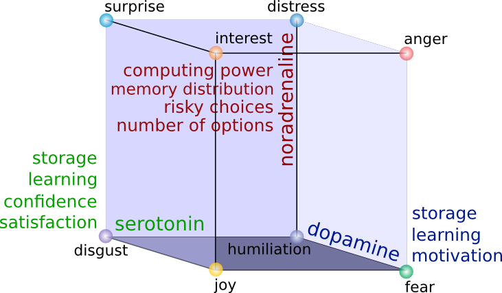

# A Cognitive Architecture for the Implementation of Emotions in Computing Systems

Jordi Vallverdu, Max Talanov, Salvatore Distefano, Manuel Mazzara, Alexander Tchitchigin, Ildar Nurgaliev

## Plan

1. Metafor
1. Issues
1. Machine cognition
1. Emotional computing system management
1. Emotions objective and subjective
1. Validation
1. Conformity with Picard criteria

## Metafor

2006: I have hit the article of Henry Liberman and Hugo Liu: "Feasibility studies for programming in natural languages". It was the description of an approach to generate the code on Python based on Natural language description (English), it was implemented in "Metafor":


###Example of processing with Metafor:

**(4) When a customer orders a drink, the bartender tries to make it. When the bartender is asked to make a drink, he makes it and gives it to the customer only if the drink is in the menu's drinks; otherwise, the bartender says "sorry i don't know how to make that drink" to the customer.**

```
class bar:
    the_bartender = bartender()
    the_menu = menu()
class bartender:
    def make(drink):
        if (drink in menu.drinks):
            bartender.make(drink)
            bartender.give(drink, customer)
    	else:
            bartender.say("sorry i don't know how to make that drink", customer)
    def give(drink, to_customer): pass
    def say(quote, to_customer): pass
class menu:
    drinks = [ sour_apple_martini, margarita, rum_and_coke ]
class drink: pass
class apple_martini(drink):
    properties = [“sour”,“sweet”]
class margarita(drink):
    properties = [“sweet”]
class rum_and_coke(drink):
    properties = [“bitter”]
class customer:
    def order(drink):
        bartender.make(drink)
```

## Issues

1. System is too fragile.
1. Not capable of the adaptation to the real life.
1. Not capable of thinking ...
1. Too many stupid rules.

##Machine cognition

The main problem of even simple tasks that involves social collaborations is to **understand** what is the user problem.

**Machine cognition (understanding) -> Machine consciousness -> Machine emotions (affective computations)**

###Cognition and consciousness and emotions.


## Emotional computing system management

##Monoamines model

**Noradrenaline** influences overall speed of thinking process, **dopamine** and **serotonin** - reward processing and learning.



 1. Generic:
   2. Computing power load: dopamine, serotonin
   2. Computing power redistribution: noradrenaline
   2. Memory distribution (attention): noradrenaline
   2. Learning: serotonin, dopamine
   2. Storage: serotonin, dopamine
 1. Decision making/reward processing:
   2. Confidence: serotonin
   2. Satisfaction: serotonin
   2. Motivation, wanting: dopamine
   2. Risky choices inclination: noradrenaline
   2. Number of options to process: noradrenaline

### Generic:

1. *Computing power load* overall load of the computational system is influenced by dopamine and serotonin that makes cortex fire spikes more actively.
1. *Computing power distribution*(computing processes distribution or load balancing) is influenced by noradrenaline the higher is noradrenaline more computing processes should be concentrated on current activity.
1. *Working memory(short term)* distribution is influenced by noradrenaline as neurotransmitter regulating attention.
1. *Learning* is impacted by serotonin and dopamine: dopamine plays major role in activation of previously remembered patterns and serotonin in pattern generation.
1. *Storage* management (long term memory) is influenced both by serotonin and dopamine, higher concentrations of both neurotransmitters the better action is remembered(less probability to forget).

### Decision making:

1. *Confidence and satisfaction* of the system is directly influenced by serotonin higher serotonin more confident is the system.
1. System is more *motivated* under influence of dopamine.
1. System tends to choose *risky* actions under impact of noradrenaline.
1. Noradrenaline makes system use less *number of options* in width and depth to be processed during reasoning.

**For example**: system is in fear state. Dopamine impacts system at half strength. This makes system choose actions highlighted with high rewards(safest in case of fear). High noradrenaline in rage state causes system to think as quick as possible taking in account as less as possible number of options, implementing first action(usually not really safe) selected "fight or flight" reaction.

##What are the neuromodulators?

###Neurotransmission


###Neuromodulation


1. *Serotonin* takes part in: behavioral state regulation and arousal, motor pattern generation, learning and plasticity, mood and social behavior also in self confidence, inner strength, satisfaction. 
2. *Dopamine* plays a major role in motor activation, reward processing, reinforcement, motivation (wanting). 
3. *Nor-adrenaline* impacts attention, vigilance, activity.

### Lövheim cube of emotions 


Objective brain work is described as neuromodulation process with base of three neuromodulatory systems:

1. Nor-adrenaline
1. Dopamine
1. Serotonin

Lövheim uses three dimensional model-cube and assumes that all emotional states could be placed in the three dimensional cube with neurotransmitters as axes and eight basic emotions ordered in an orthogonal coordinate system that are affective states. Affective states are inherited from affect theory of Tomkins:

 1. Enjoyment/Joy
 1. Interest/Excitement
 1. Surprise
 1. Anger/Rage
 1. Disgust
 1. Distress/Anguish
 1. Fear/Terror
 1. Shame/Humiliation

## Sanity testing

### Recurrent NN


The neuromodulation is simulated in primitive way: propagating the output of exit neuron to intermediate layer to 50 percent of neurons (determined randomly).

Training set:

* 1, 2: [0 - 100] and 3, 4: [100 - 255] = 2
* 1, 2: [100 - 255] and 3, 4: [0 - 100] = 1

#### Results

Below threshold:

**ANN:**


**RNN:**


Above threshold:

**ANN**


**RNN**


### Spiking NN


Connectivity diagram showing excitatory glutamatergic pathways as red, inhibitory GABAergic pathways as blue, and modulatory dopaminergic pathways as magenta. (Abbreviations: GPe: globus pallidus external; GPi: globus pallidus internal; STN: subthalamic nucleus; SNc: substantia nigra compacta; SNr: substantia nigra reticulata)

The antagonistic functions of the direct and indirect pathways are modulated by the **substantia nigra pars compacta (SNc)**, which produces **dopamine**. In the presence of dopamine, D1-receptors in the basal ganglia stimulate the GABAergic neurons, favoring the direct pathway, and thus increasing movement. The GABAergic neurons of the indirect pathway are stimulated by excitatory neurotransmitters acetylcholine and glutamate. This sets off the indirect pathway that ultimately results in inhibition of upper motor neurons, and less movement. In the presence of dopamine, D2-receptors in the basal ganglia inhibit these GABAergic neurons, which reduces the indirect pathways inhibitory effect. **Dopamine therefore increases the excitatory effect of the direct pathway (causing movement) and reduces the inhibitory effect of the indirect pathway (preventing full inhibition of movement)**. 

This way we simulate:

1. Cortex
1. Striatum
1. GPe: globus pallidus external
1. GPi: globus pallidus internal 
1. STN: subthalamic nucleus
1. SNc: substantia nigra compacta
1. SNr: substantia nigra reticulata

With two main pathways:

**Direct pathway**

**Cortex** (stimulates) -> **Striatum** (inhibits) -> **"SNr-GPi" complex** (less inhibition of thalamus) -> **Thalamus** (stimulates) -> **Cortex** (stimulates) -> **Muscles, etc.**

**Indirect pathway**

**Cortex** (stimulates) -> **Striatum** (inhibits) -> **GPe** (less inhibition of STN) ->**STN** (stimulates) -> **"SNr-GPi" complex** (inhibits) -> **Thalamus** (is stimulating less) -> **Cortex** (is stimulating less) -> Muscles, etc.

Neuromodulation is implemented by SNc via production of the **dopamine** that influences Striatum triggering direct or indirect pathway.

### Results

#### Thalamus

**No Dopamine:**


**Dopamine neuromodulation:**


#### Cortex

**No Dopamine:**


**Dopamine neuromodulation:**


## Conformity with Picard criteria

Rosalind Picard in her article "What does it mean for a computer to "have" emotions?" (2001) suggested following criteria to measure emotional capabilities of a computing system:

1. Emotional appearance
1. Multi-level emotion generation
1. Emotional experience
1. Mind-body interactions

Emotional appearance is not discussed in this work. 

Multi-level emotion cognition and behavior generation was demonstrated in "Emotions in six thinking levels" and "Feeling the state and neuromodulation" sections. 

Emotional experience is complex that consists of: "cognitive or semantic label; physiological changes; subjective feeling, intuition" we have scratch the surface and suggested psychological changes mechanism according to Lövheim model and subjective emotions perceptions in this work. 

Mind-body interactions consists of: "conscious and non-conscious events; regulatory and signaling mechanisms; biasing mechanisms, intuition; physiological and biochemical changes; sentic modulation, lying impacts pressure; waveform of love; smiles induce joy..." this partly could be implemented by presented model. 

Conscious and non-conscious mechanisms of stimulus processing was presented. 

Psychological and biochemical changes where presented in "Feeling the state and neuromodulation" and "Neuromodulation to computing system management mapping".

### Domains

1. Computer games
1. Intellectual assistant capable of emotional dialogs and thinking
1. Automatic interviewers
1. Estimating human responses in the interest of manipulating it
1. Simulations of large social groups
1. Call centre automation
1. Software and hardware support automation
1. Virtual friends
1. Nursing software
1. Applications in emotional robots

#References

1. Lövheim, H. (2012). A new three-dimensional model for emo-
tions and monoamine neurotransmitters,
1. Damasio, A. (1999). The Feeling of What Happens.
1. Minsky, M. (2006). The Emotion Machine: Commonsense Thinking, Artificial Intelligence, and the Future of the Human Mind
1. R.W. Picard (2001), "What Does it Mean for a Computer to "Have" Emotions?," Chapter in "Emotions in Humans and Artifacts,"

#Thank you.

max.talanov@gmail.com
