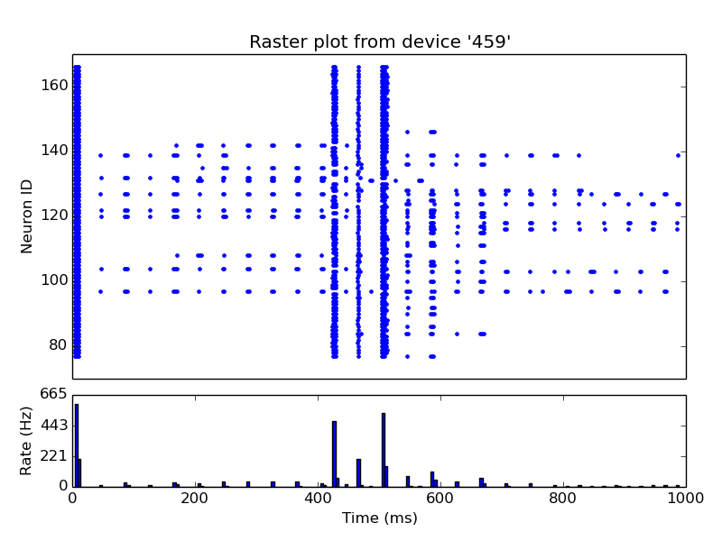
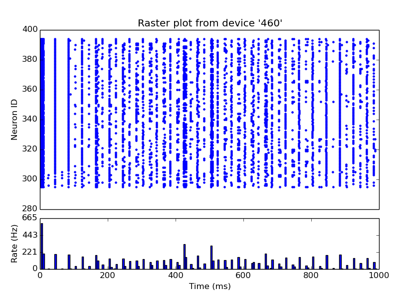

#Towards Anthropo-inspired Computational Systems: the P^3 Model

Michael W. Bridges, Salvatore Distefano, Manuel Mazzara, Marat Minlebaev, Max Talanov, and Jordi Vallverdu.

## Plan

1. Machine cognition
1. P^3 model
1. Emotional model built on base of P^3 approach
1. Validation

##Machine cognition

**Machine cognition (understanding) <- Machine consciousness <- Machine emotions (affective computations)**

##P^3 model

###The problem

###The model

**PhysioComputing** implements the physiology of computing. It is therefore usually
related to the hardware and the low level software, e.g. the firmware, providing
the basic functionalities for a computing system to properly work. From an
abstract point of view PhysioComputing provides the basic mechanisms implementing the main functionalities for a computing system to work. The scope of
PhysioComputing is on structural, functional, organizational and communicational aspects of computing systems.

**MindComputing** is the psychology of computing. It should consider the high
level details of phenomena taking into account broader and more conceptual
approaches of the artificial mind operation based on the concepts, mechanisms,
and functionalities introduced and provided at lower level by the PhysioComputing. From an abstract computer systems perspectives, PhysioComputing implements advanced and enhanced, mechanisms, policies, and strategies for locally
optimizing the system, just considering the system introspectively. Scope of the
MindComputing is therefore to implement enhanced services or systems on top
of basic mechanisms, processes and functionalities provided by the lower level.

**MetaComputing** is the philosophy of computing. Based on the MindComputing
and PhysioComputing concepts, mechanisms and policies, it provides a further
abstraction from a more general viewpoint, i.e. considering the interaction of the
overall computing system with the environment, from outside. This is a meta-
level, where the computing system is considered as part of the environment
and its interactions with the other systems or elements are taken into account.
The scope of MetaComputing includes definitions and high level, meta-views
on the problems, thus providing meta-solutions to be enforced as policies and
mechanisms at lower MindComputing and PhysioComputing layers.

## Emotional model built on base of P^3 approach
(Monoamines model)

**Noradrenaline** influences overall speed of thinking process, **dopamine** and **serotonin** - reward processing and learning.

 1. Generic:
   2. Computing power load: dopamine, serotonin
   2. Computing power redistribution: noradrenaline
   2. Memory distribution (attention): noradrenaline
   2. Learning: serotonin, dopamine
   2. Storage: serotonin, dopamine
 1. Decision making/reward processing:
   2. Confidence: serotonin
   2. Satisfaction: serotonin
   2. Motivation, wanting: dopamine
   2. Risky choices inclination: noradrenaline
   2. Number of options to process: noradrenaline

### Generic:

1. *Computing power load* overall load of the computational system is influenced by dopamine that makes cortex fire spikes more actively.
1. *Computing power distribution*(computing processes distribution or load balancing) is influenced by noradrenaline the higher is noradrenaline more computing processes should be concentrated on current activity.
1. *Working memory(short term)* distribution is influenced by noradrenaline as neurotransmitter regulating attention.
1. *Learning* is impacted by serotonin and dopamine: dopamine plays major role in activation of previously remembered patterns and serotonin in pattern generation.
1. *Storage* management (long term memory) is influenced both by serotonin and dopamine, higher concentrations of both neurotransmitters the better action is remembered(less probability to forget).

### Decision making:

1. *Confidence and satisfaction* of the system is directly influenced by serotonin higher serotonin more confident is the system.
1. System is more *motivated* under influence of dopamine.
1. System tends to choose *risky* actions under impact of noradrenaline.
1. Noradrenaline makes system use less *number of options* in width and depth to be processed during reasoning.

**For example**: system is in fear state. Dopamine impacts system at half strength. This makes system choose actions highlighted with high rewards(safest in case of fear). High noradrenaline in rage state causes system to think as quick as possible taking in account as less as possible number of options, implementing first action(usually not really safe) selected "fight or flight" reaction.

##What are the neuromodulators?

###Neurotransmission

###Neuromodulation

1. *Serotonin* takes part in: behavioral state regulation and arousal, motor pattern generation, learning and plasticity, mood and social behavior also in self confidence, inner strength, satisfaction. 
2. *Dopamine* plays a major role in motor activation, reward processing, reinforcement, motivation (wanting). 
3. *Nor-adrenaline* impacts attention, vigilance, activity.

### Lövheim cube of emotions 

Objective brain work is described as neuromodulation process with base of three neuromodulatory systems:

1. Nor-adrenaline
1. Dopamine
1. Serotonin

Lövheim uses three dimensional model-cube and assumes that all emotional states could be placed in the three dimensional cube with neurotransmitters as axes and eight basic emotions ordered in an orthogonal coordinate system that are affective states. Affective states are inherited from affect theory of Tomkins:

 1. Enjoyment/Joy
 1. Interest/Excitement
 1. Surprise
 1. Anger/Rage
 1. Disgust
 1. Distress/Anguish
 1. Fear/Terror
 1. Shame/Humiliation

## Sanity testing

### Spiking NN

Connectivity diagram showing excitatory glutamatergic pathways as red, inhibitory GABAergic pathways as blue, and modulatory dopaminergic pathways as magenta. (Abbreviations: GPe: globus pallidus external; GPi: globus pallidus internal; STN: subthalamic nucleus; SNc: substantia nigra compacta; SNr: substantia nigra reticulata)

The antagonistic functions of the direct and indirect pathways are modulated by the **substantia nigra pars compacta (SNc)**, which produces **dopamine**. In the presence of dopamine, D1-receptors in the basal ganglia stimulate the GABAergic neurons, favoring the direct pathway, and thus increasing movement. The GABAergic neurons of the indirect pathway are stimulated by excitatory neurotransmitters acetylcholine and glutamate. This sets off the indirect pathway that ultimately results in inhibition of upper motor neurons, and less movement. In the presence of dopamine, D2-receptors in the basal ganglia inhibit these GABAergic neurons, which reduces the indirect pathways inhibitory effect. **Dopamine therefore increases the excitatory effect of the direct pathway (causing movement) and reduces the inhibitory effect of the indirect pathway (preventing full inhibition of movement)**. 

This way we simulate:

1. Cortex
1. Striatum
1. GPe: globus pallidus external
1. GPi: globus pallidus internal 
1. STN: subthalamic nucleus
1. SNc: substantia nigra compacta
1. SNr: substantia nigra reticulata

With two main pathways:

**Direct pathway**

**Cortex** (stimulates) -> **Striatum** (inhibits) -> **"SNr-GPi" complex** (less inhibition of thalamus) -> **Thalamus** (stimulates) -> **Cortex** (stimulates) -> **Muscles, etc.**

**Indirect pathway**

**Cortex** (stimulates) -> **Striatum** (inhibits) -> **GPe** (less inhibition of STN) ->**STN** (stimulates) -> **"SNr-GPi" complex** (inhibits) -> **Thalamus** (is stimulating less) -> **Cortex** (is stimulating less) -> Muscles, etc.

Neuromodulation is implemented by SNc via production of the **dopamine** that influences Striatum triggering direct or indirect pathway.

### Results

#### Thalamus

#### Cortex

### Domains

1. Computer games
1. Intellectual assistant capable of emotional dialogs and thinking
1. Automatic interviewers
1. Estimating human responses in the interest of manipulating it
1. Simulations of large social groups
1. Call centre automation
1. Software and hardware support automation
1. Virtual friends
1. Nursing software
1. Applications in emotional robots

#References

1. Lövheim, H. (2012). A new three-dimensional model for emo-
tions and monoamine neurotransmitters,
1. Damasio, A. (1999). The Feeling of What Happens.
1. Minsky, M. (2006). The Emotion Machine: Commonsense Thinking, Artificial Intelligence, and the Future of the Human Mind
1. R.W. Picard (2001), "What Does it Mean for a Computer to "Have" Emotions?," Chapter in "Emotions in Humans and Artifacts,"

#Thank you.

max.talanov@gmail.com
