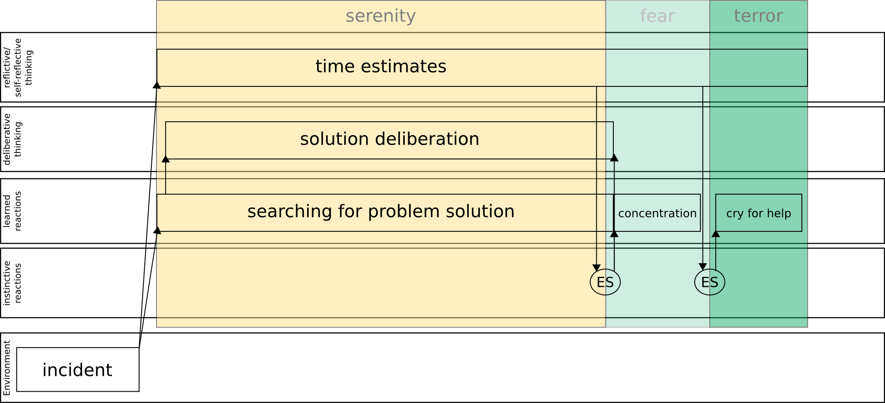

#Emotional thinking from bird eye view

##Definitions of emotions and affect

###Marvin Minsky

Sometimes a person gets into a state where everything seems to be cheerful and bright—although nothing outside has actually changed. Other times everything pleases you less: the entire world seems dreary and dark, and your friends complain that you seem depressed. Why do we have such states of mind—or moods, or feelings, or dispositions—and what causes all their strange effects? Here are some of the phrases we find when dictionaries define **emotion**.

1. The subjective experience of a strong feeling.
1. A state of mental agitation or disturbance.
1. A mental reaction involving the state of one’s body.
1. A subjective rather than conscious affection.
1. The parts of consciousness that involve feeling.
1. A nonrational aspect of reasoning.

###Gerd Ruebenstrunk

####Definitions of "affect"

1. The conscious subjective aspect of feeling or emotion
1. The observable emotional condition of an individual at any given time
1. Generalized feeling tone (usually considered more persistent than emotion, less so than mood). It is the external, observable manifestation of emotion (e.g., flat, blunted, constricted, expansive, labile, etc.)
1. Emotion, feeling or mood

####Definitions of "emotion"

1. Any strong feeling
1. Feelings such as happiness, sadness, anger, elation, irritation, etc. The specific definition of emotion is difficult to qualify as it is a completely subjective experience
1. A psychological feeling, usually accompanied by a physiological reaction
1. The feeling one experiences in reaction to a person or situation

###Aaron Sloman

####The trouble with definitions

Part of the problem is that many of the words we use for describing human mental states and processes (including 'emotion', 'learning', 'intelligence', 'consciousness') are far too ill-defined to be useful in scientific theories. Not even professional scientists are close to using agreed definitions of, '**emotion**'.

1. The concept of emotion is but one of a large family of intricately related everyday concepts, including many affective concepts (e.g. moods, attitudes, desires, dislikes, preferences, values, standards, ideals, intentions, etc.), the more enduring of which can be thought of as making up the notion of a "personality".
1. Models that purport to account for "**emotion**" without accounting for others in the family are bound to be shallow.

Specifying what we are talking about generates difficult conceptual problems. Whichever of the three motivations listed above drives the modelling of emotions and other mental phenomena, the work understandably starts from concepts of ordinary language (e.g. "emotion", "mood", "feeling", "pleasure", etc.). These concepts can be deceptive to those not trained in philosophical analysis. The concepts are so familiar that they appear to have very clear, commonly understood, meanings, whereas detailed analysis shows that the opposite is true: the familiar labels often refer to concepts that are riddled with confusion and ambiguity, and when people attempt to define them they come up with widely different definitions. For instance in the psychological literature there are a multitude of definitions of “emotion”, some stressing brain processes, some stressing peripheral physiological processes, some stressing patterns of behaviour, some stressing eliciting conditions, some stressing the functional roles, some stressing introspective qualities. This diversity was already evident long ago in the collection edited by Magda Arnold (1968).

####Lowe and Ziemke

Affective computation 1 concerns multifaceted emotional or emotion-relevant cognitive phenomena including attention, perception, memory, learning and decision making with the premise that it is in fact indispensable to rational cognitive behavior.

...

Affect is used either synonymously with, or in contradistinction to, emotion. For some (cf. [11]), affect is considered an umbrella term for valenced neurophysiological phenomena (e.g. drives, motivations, emotions, feelings, moods). In this sense, emotion is a type of affective state. However, it has also been considered as distinct from emotion, founded upon enduring valenced states (e.g. moods) whereas emotions are viewed in terms of fast object-directed responses ([12]). In this sense, emotion is a related but distinct phenomenon to affect.

...

We will here follow Pessoa [59] in acknowledging that emotion (much like cognition, in fact) is difficult to define clearly, and that trying to provide yet another explicit definition might not be helpful.

####Marsella and Gratch

Further, emotions are an important cue to a person’s mental state and are frequently attributed to humans in the absence of any visible signal (e.g., he is angry but suppressing it) so failure to model and express emotions in virtual humans leads users to misinterpret the virtual human behavior. Virtual humans that model and express emotions also provide more engaging experiences for the immersed human users.

###Antonio R. Damasio

Emotion in the perspective of an integrated nervous system" emphasized the effect of emotions: "The ultimate results of emotion are of two kinds. First there are behaviors — the expressing of joy, or anger, or disgust — which affect interactions with other living creatures. Second, there are experiences of emotional states, that is feelings, which affect the ongoing thinking of the subject and by so doing can alter future thinking, future planning and future behavior.

##Orchestra of emotions

Imagine the number of emotions we experience every day, every minute, starting from wake up in the morning till the late evening. Every action or significant change in environment is followed by emotional response. When we were kids and we could not control emotions expressions even wake up and washing the teeth was an emotional scene.

### Example

You have got the task on the timely basis: solve some problem in 15 minutes.

1. First of all you are calm and using some learned information to solve the problem.
1. When you realize that there is not that much time left, for example 5 minutes, you start feeling some anxiety and concentrate on the task.
1. Then you realize there is no time left, you start panic (for example :-)), and cry for help.

This is example of how do we use emotions in time control to change our actions strategy in everyday life.

##The emotion machine (Model 6)

First starting point is the philosophy, we use Marvin Minsky book ["The emotion machine"](http://en.wikipedia.org/wiki/The_Emotion_Machine).

###Marvin Minsky's question:

"What could make our brain grow?" In other words our ancestors monkeys that lived in some form till some moment 5 million years ago, what could trigger their brain to increase the frontal lobe? 

1. `Inborn, Instinctive Reactions: Joan hears a sound and turns her head. All animals are born equipped with ‘instincts’ that help them to survive.`
1. `Learned Reactions: She sees a quickly oncoming car. Joan had to learn that conditions like this demand specific ways to react.`
1. `Deliberative Thinking: To decide what to say at the meeting, she considers several alternatives, and tries to decide which would be best.`
1. `Reflective Thinking: Joan reflects upon what she has done. She reacts, not just to things in things in the world, but also to recent events in her brain.`
1. `Self-Reflective Thinking: Being “uneasy about arriving late” requires her to keep track of the plans that she’s made for herself.`
1. `Self Conscious Emotions: When asking what her friends think of her, she also asks how her actions concord with ideals she has set for herself.`

Our practical examle in this model:

This is deliberatevly simplifed mapping of emotions to the "Model of six".

##Psychological view

Starting form Darwin.

###Plutchik wheel of emotions

Axes:

1. Pleasantness (joy - sadness)
1. Attention (interest - surprise)
1. Sensitivity (anger - fear)
1. Aptitude (trust - disgust)

###Tomkins theory of affects

**Positive:**

* Enjoyment/Joy - smiling, lips wide and out
* Interest/Excitement - eyebrows down, eyes tracking, eyes looking, closer listening

**Neutral:**
* Surprise/Startle - eyebrows up, eyes blinking

**Negative:**
* Anger/Rage - frowning, a clenched jaw, a red face
* Disgust - the lower lip raised and protruded, head forward and down
* Dissmell (reaction to bad smell) - upper lip raised, head pulled back
* Distress/Anguish - crying, rhythmic sobbing, arched eyebrows, mouth lowered
* Fear/Terror - a frozen stare, a pale face, coldness, sweat, erect hair
* Shame/Humiliation - eyes lowered, the head down and averted, blushing

##Neuroscientific view 

###Cube of emotions by Hugo Lovheim

###Dopamine and serotonin pathways

##References

1. [Plutchik, Wheel of emotion, Wikipedia page](http://en.wikipedia.org/wiki/Contrasting_and_categorization_of_emotions)
1. [Tomkins, Theory of affects, Wikipedia page](http://en.wikipedia.org/wiki/Affect_theory)
1. [Marvin Minsky, The emotion Machine Draft, Falling in love](http://web.media.mit.edu/~minsky/E1/eb1.html)
1. [Aaron Sloman, Varieties of Affect and the CogAff Architecture Schema](http://www.cs.bham.ac.uk/research/projects/cogaff/sloman-aisb01.pdf)
1. [Gerd Ruebenstrunk, Affective Systems](http://www.cs.bham.ac.uk/research/projects/cogaff/links/ruebenstrunk-presentation4.pdf)
1. Lowe and Ziemke, On the Role of Emotion in Embodied Cognitive Architectures:From Organisms to Robots
1. [Marsella and Gratch, Evaluating a computational model of emotion](http://people.ict.usc.edu/~marsella/publications/GratchMarsellaJAAMAS05.pdf)
1. [Lovheim, Cube of emotions, Wikipedia page](http://en.wikipedia.org/wiki/L%C3%B6vheim_cube_of_emotion)
1. [Nucleus accumbens, Wikipedia page](http://en.wikipedia.org/wiki/Nucleus_accumbens)
1. [Striatum, Wikipedia page](http://en.wikipedia.org/wiki/Striatum)
1. [Hippocampus, Wikipedia page](http://en.wikipedia.org/wiki/Hippocampus]
