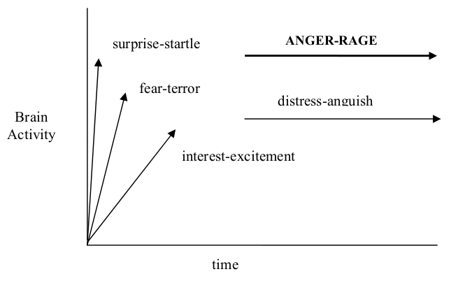
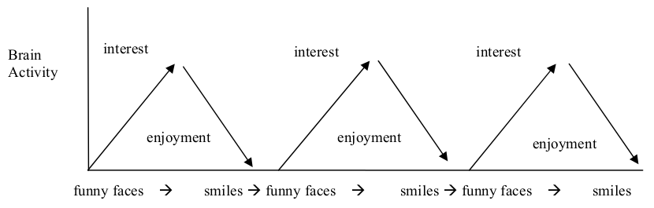
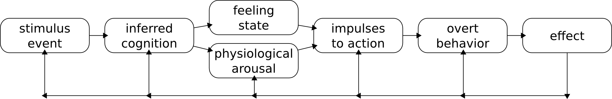
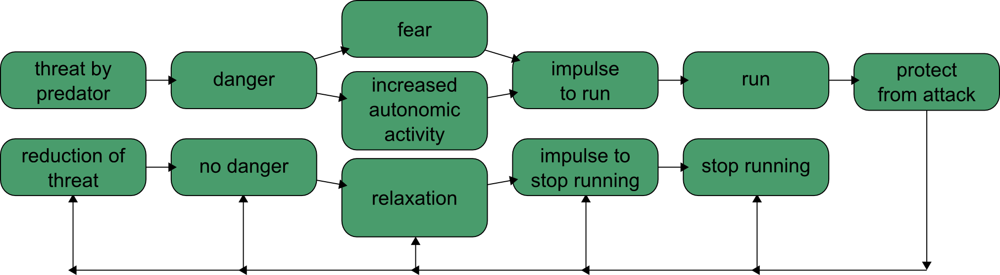
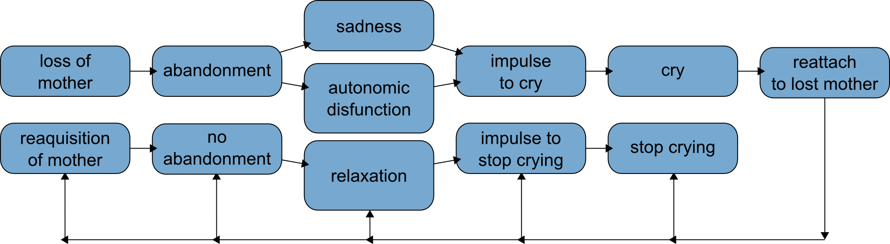
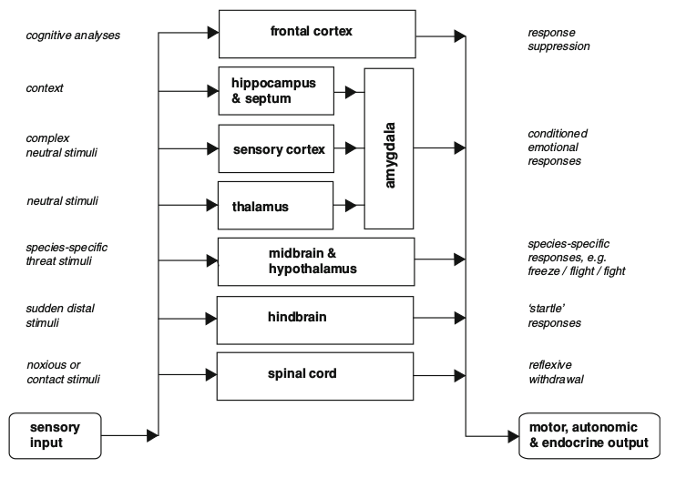

#Psychological models of emotion

##Tomkins Theory of affects

"An affect is a biological event, a normal part of the everyday functioning of our central nervous system (CNS). An affect is, in some respects, like a normal knee jerk reflex. If one applies the proper stimulus to the patellar tendon—a tap with a small hammer—in just the right place with just the right amount of force, then the lower leg will jerk upwards. Similarly, if the proper stimulus is received in the CNS, an affect is triggered."

"stimuli that do not trigger an affect, do not enter into our conscious awareness"

##Sensory homunculus

##9 affects

##Patterns of affects

"When a stimulus is received in our CNS, the instantaneous response of the brain can only be in one of three patterns."

##Increasing Rate Of Brain Activity

###Interest-Excitement

"When interest-excitement is triggered the eyebrows turn down and the face has a “track, look, and listen” appearance. The affects are all visible on the face virtually from birth."

###Fear-terror

"When fear-terror is triggered the eyes become wide open and frozen. The face gets pale, cold, and sweaty and the hair, especially on the back of the neck, becomes erect."

###Surprise-startle

"When surprise-startle is triggered, the eyebrows go up, the eyes blink and the mouth gets an O STEADY."

##State Brain Activity

###Distress-Anguish

"Distress-anguish is triggered whenever there is an above optimal, steady-state pattern of stimulus density."

"The facial response indicative of distress-anguish includes crying, tears, arching of the eyebrows, a mouth with turned down corners and rhythmic sobbing."

###Anger-rage

"The line representing anger-rage in the graph makes it clear that stimuli that trigger it have a pattern that is much denser than that of distress-anguish. This creates a level of brain activity that is way too much. Anger-rage is the affect of overload."

"The facial response when anger-rage is triggered is one we all recognize. The face becomes red, accompanied by a frown and a clenched jaw."

##Decreasing Rate Of Brain Activity

###Enjoyment-Joy

"The face of enjoyment-joy is a pleasure. There is a smile and the lips are widened up and out."

##Rest of affects

###Disgust

"This NEGATIVE affect is inherently punishing and provides us some protection against eating poisonous or rotten food. Of course, some things that are poisonous do not taste bad or cause a reaction in the stomach that triggers vomiting.

...

The actions of the head and face when disgust is triggered involve a forward movement of the head, a protrusion of the tongue, and a pushing down of the lower lip. If the response is very intense, then vomiting occurs."

###Dissmell

"It is the automatic response we have when we smell something rotten, like rotten milk or fresh feces or decaying organic matter. Dissmell is triggered when the smell stimulus reaches the brain and the head draws back and away and the upper lip wrinkles."

###Shame-Humiliation

"Shame-humiliation was the last of the affects to evolve. As is the case for many aspects of our evolution, shame-humiliation evolved because there was a problem. The best way to describe the problem is to think of the function of the affect system. It records general information about and makes us aware of certain stimulus conditions. Shame-humiliation came after the system already had the ability to record and make us aware of stimulus conditions in the form of five negative affects (fear, distress, anger, disgust, and dissmell), one neutral affect (surprise), and two positive affects (interest and enjoyment). What additional information did the early members of our species need? They did not need more information about the negative affects. Since fear, distress, anger, disgust and dissmell are inherently punishing, they are already sufficiently motivating for us to do things to get them to stop. Nor did our ancestors need further information about surprise-startle. This affect is neither inherently punishing nor rewarding. It is like a computer’s reset button that rapidly clears the system and prepares us for whatever comes next."

##Central Blueprint For Motivation

1. Positive affect should be maximized,
1. Negative affect should be minimized,
1. Affect inhibition should be minimized,
1. The power to maximize positive affect, to minimize negative affect, to minimize the inhibition of affect should be maximized.

##Plutchik Wheel of emotions

"By one estimate, more than 90 definitions of "emotion" were proposed over the course of the 20th century. If there is little consensus on the meaning of the term, it is no wonder that there is much disagreement among contemporary theoreticians concerning the best way to conceptualize emotion and interpret its role in life."

###Feedback loop

####Fear example

####Sadness example

###Emotional substrates

|stimulus event        |cognition  |feeling state|overt behavior   |effect                 |
|:--------------------:|:---------:|:-----------:|:---------------:|:---------------------:|
|threat                |danger     |fear         |escape           |safety                 |
|obstacle              |enemy      |anger        |attack           |destroy obstacle       |
|gain of valued object |possess    |joy          |retain or repeat |gain resources         |
|loss of valued object |abandonment|sadness      |cry              |reattach to lost object|
|member of one s group |friend     |acceptance   |groom            |mutual support         |
|unpalatable object    |poison     |disgust      |vomit            |eject poison           |
|new territory         |examine    |expectation  |map              |knowledge of territory |
|unexpected event      |what is it?|surprise     |stop             |gain time to orient    |

###Wheel of emotion

####Axes:

1. Pleasantness (joy - sadness)
1. Attention (interest - surprise)
1. Sensitivity (anger - fear)
1. Aptitude (trust - disgust)

##Hierarchical organization of defensive behaviors by Prescott et al.

"[S]ubsumption architecture (where higher levels can suppress and override lower ones). The levels span from low-level reflexive mechanisms, over midbrain-mediated mechanisms (such as flight-or-fight responses), and amygdala-mediated conditioned responses, to cortical cognitive mechanisms. In this scheme, emotion is mainly associated with the role of the amygdala."[Ziemke and Lowe]

"Behavioral organization of defensive behaviors as a subsumption architecture (as an example of the layered architecture of the mammalian brain). Adapted from Prescott et al."[Ziemke and Lowe]

##Emotions from brain to robot by Arbib and Fellous

"The amygdala can influence cortical areas via feedback from proprioceptive, visceral or hormonal signals, via projections to various 'arousal' networks, and through interaction with the medial prefrontal cortex"[Ziemke and Lowe]

"Interactions between amygdala, cortical, and subcortical areas in the mammalian brain (mPFC/dlPFC: medial/dorsolateral prefrontal cortex). Adapted from Arbib and Fellous."[Ziemke and Lowe]

"Arbib and Fellous’ view of behavioral organization with respect to potential for neuromodulation and action specificity-mapping brain and nervous system structures to (examples of) reflexes, drives, instincts and motivations, and cognitions (CPG: central pattern generators, PAG: periaqueductal gray, RF: reticular formation, NTS: nucleus of the solitary tract). The ellipses represent zones of neural recruitment during emotional expression and experience, whose neural substrate is argued to be intimately linked to that of neuromodulation. Adapted from Arbib and Fellous"[Ziemke and Lowe]

##References

### Chat bot

1. [Existor](http://www.existor.com/)

### Papers

1. [Vernon C. Kelly, Jr., M.D., A Primer Of Affect Psychology](http://www.tomkins.org/uploads/Primer_of_Affect_Psychology.pdf)
1. [Robert Plutchik, The Nature of Emotions](http://www.americanscientist.org/my_amsci/restricted.aspx?act=pdf&id=2762150868143)
1. [Tom Ziemke and Robert Lowe, On the Role of Emotion in Embodied Cognitive Architectures: From Organisms to Robots](http://link.springer.com/article/10.1007%2Fs12559-009-9012-0?LI=true)
1. Prescott TJ, Redgrave P, Gurney K. Layered control architectures in robots and vertebrates. Adapt Behav. 1999;7:99–127.
1. Arbib M, Fellous J-M. Emotions: From brain to robot. Trend Cognit Sci. 2004;8(12):554–61.
