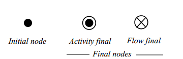
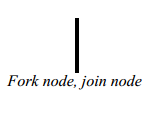
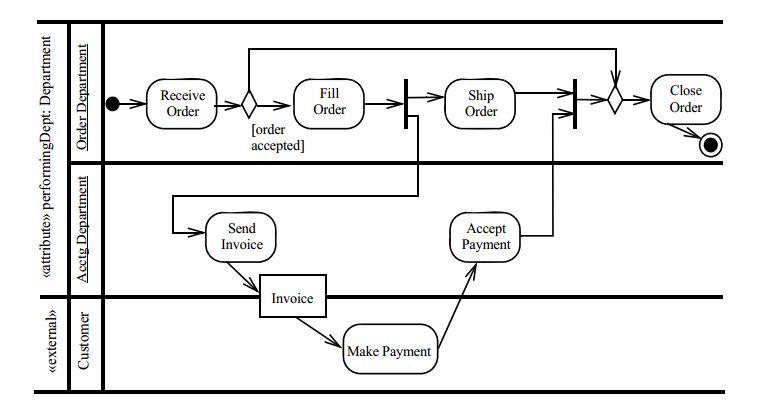
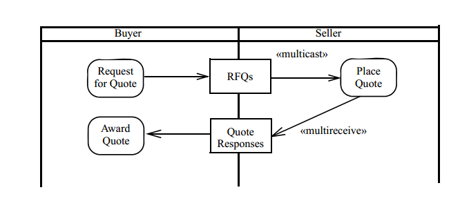

#Activity digaram.

[Activity diagram](https://en.wikipedia.org/wiki/Activity_diagram)are graphical representations of workflows of stepwise activities and actions with support for choice, iteration and concurrency. In the Unified Modeling Language, activity diagrams are intended to model both computational and organisational processes (i.e. workflows). Activity diagrams show the overall flow of control.

## Constructs

### Start and stop

### Split and join

### Actions and objecs

### Decisions

### Swim lines

Is usualy used to denote an actor of an action

## Connectors

