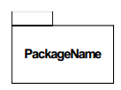
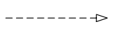
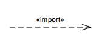

#Class diagram.

[Class diagram](http://en.wikipedia.org/wiki/Class_diagram) is a type of static structure diagram that describes the structure of a system by showing the system's classes, their attributes, operations (or methods), and the relationships among objects.

## Constructs

### Class

#### Visibility

* "+"       Public 
* "-"       Private 
* "#"       Protected 
* "/"       Derived (can be combined with one of the others)
* "_"       Static
* "~"       Package

### Instance

### Package

### Interface

## Connectors

### Association

#### Multiplicity

* __0..1__	No instances, or one instance (optional, may)
* __1__	Exactly one instance
* __0..* or *__	Zero or more instances
* __1..*__	One or more instances (at least one)

### Generalisation

### Realisation

### Aggregation and compositon

* Aggregation "has a" connection
* Composition "owns a" connection

### Import (Package)

