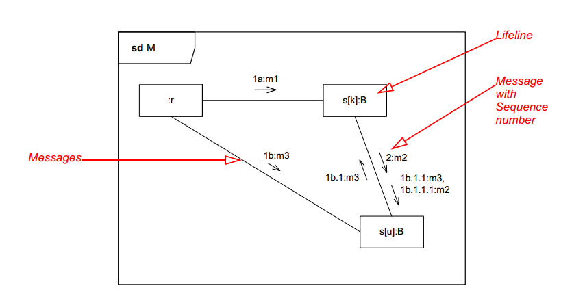

#Communication diagram.

[Communication diagram](https://en.wikipedia.org/wiki/Communication_diagram) n the Unified Modeling Language (UML) 2.0, is a simplified version of the UML 1.x collaboration diagram.

## Constructs

### Object

## Connectors

### Association

