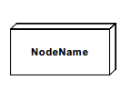
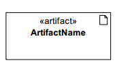
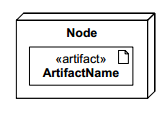
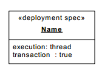
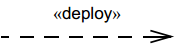

#Deployment diagram.

A [deployment diagram](https://en.wikipedia.org/wiki/Deployment_diagram) in the Unified Modeling Language models the physical deployment of artifacts on nodes.[1] To describe a web site, for example, a deployment diagram would show what hardware components ("nodes") exist (e.g., a web server, an application server, and a database server), what software components ("artifacts") run on each node (e.g., web application, database), and how the different pieces are connected (e.g. JDBC, REST, RMI).

## Constructs

### Artifact

### Node

### Artifact deployed on node

### Node with deployed artifacts

### Deployment specification

### Artifact with annotated deployment properties

## Connectors

### Association

### Dependency

### Generalization

### Deployment

### Manifestation

