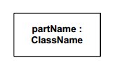
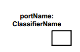
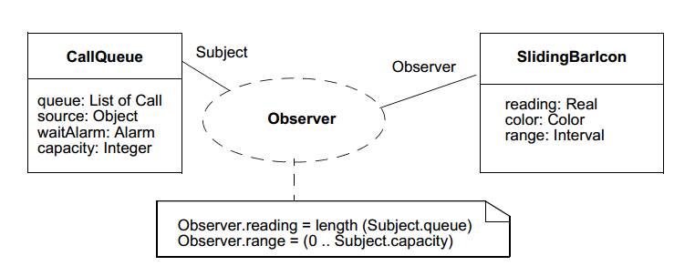
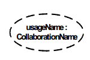
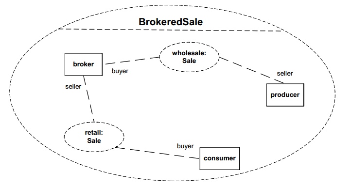

#Deployment diagram.

A [deployment diagram](https://en.wikipedia.org/wiki/Deployment_diagram) in the Unified Modeling Language models the physical deployment of artifacts on nodes.[1] To describe a web site, for example, a deployment diagram would show what hardware components ("nodes") exist (e.g., a web server, an application server, and a database server), what software components ("artifacts") run on each node (e.g., web application, database), and how the different pieces are connected (e.g. JDBC, REST, RMI).

This diagram can include internal parts, ports through which the parts interact with each other or through which instances of the class interact with the parts and with the outside world, and connectors between parts or ports. A composite structure is a set of interconnected elements that collaborate at runtime to achieve some purpose. Each element has some defined role in the collaboration.

## Constructs

### Part

### Port

### Collaboration

### CollaborationUse

## Connectors

### Connector

### Role binding

