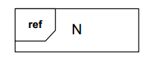
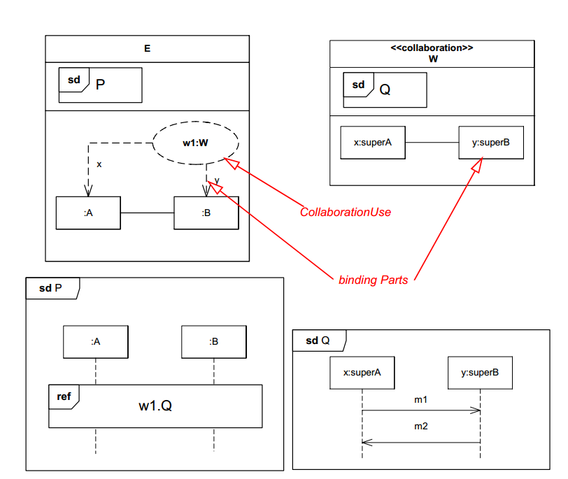

#Interaction overview diagram.

[Interaction Overview Diagram](https://en.wikipedia.org/wiki/Interaction_overview_diagram) is one of the fourteen types of diagrams of the Unified Modeling Language (UML), which can picture a control flow with nodes that can contain interaction diagrams.
The interaction overview diagram is similar to the activity diagram, in that both visualize a sequence of activities. The difference is that, for an interaction overview, each individual activity is pictured as a frame which can contain a nested interaction diagram. This makes the interaction overview diagram useful to "deconstruct a complex scenario that would otherwise require multiple if-then-else paths to be illustrated as a single sequence diagram".

## Constructs

### Frame

### Interaction

### Interaction use

## Collaboration example

