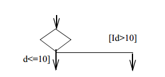
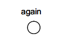
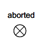
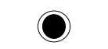
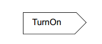
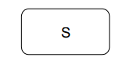
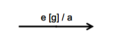
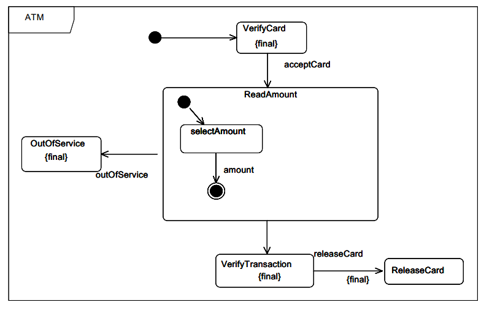

#State machine diagram.

UML [state machine](https://en.wikipedia.org/wiki/UML_state_machine), also known as UML statechart, is a significantly enhanced realization of the mathematical concept of a finite automaton in computer science applications as expressed in the Unified Modeling Language (UML) notation.

## Constructs

### Action

### Choice

### Composite state

### Entry point

### Exit point

### Final state

### Initial state

### Receive signal

### Send signal

### Region

### State

### State machine

### Terminal node

### Submachine

## Connectors

### Transition

