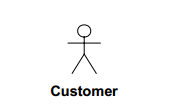

# Use case diagram

[Use case diagram](https://en.wikipedia.org/wiki/Use_cases) In software and systems engineering, a use case is a list of steps, typically defining interactions between a role (known in UML as an "actor") and a system, to achieve a goal. The actor can be a human or an external system.

## Constructs

### Actor

### Instance

### Package

### Interface

## Connectors

### Association

#### Multiplicity

* __0..1__	No instances, or one instance (optional, may)
* __1__	Exactly one instance
* __0..* or *__	Zero or more instances
* __1..*__	One or more instances (at least one)

### Generalisation

### Realisation

### Aggregation and compositon

* Aggregation "has a" connection
* Composition "owns a" connection

### Import (Package)

