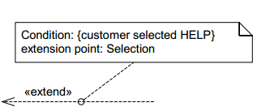
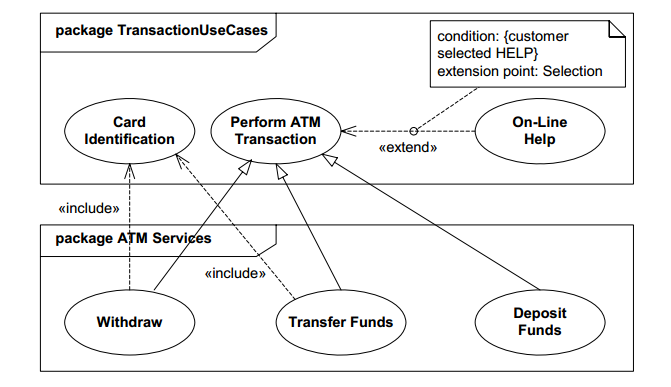

# Use case diagram

[Use case diagram](https://en.wikipedia.org/wiki/Use_cases) In software and systems engineering, a use case is a list of steps, typically defining interactions between a role (known in UML as an "actor") and a system, to achieve a goal. The actor can be a human or an external system.

## Constructs

### Actor

### Use case

## Connectors

### Inclusion

### Extension

## Examples

### With state chart

### With various packages

