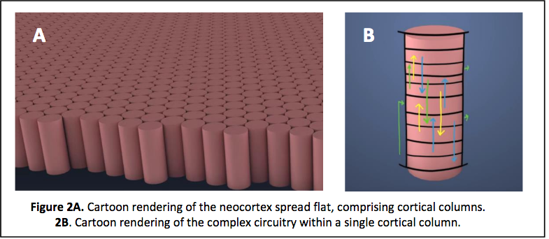
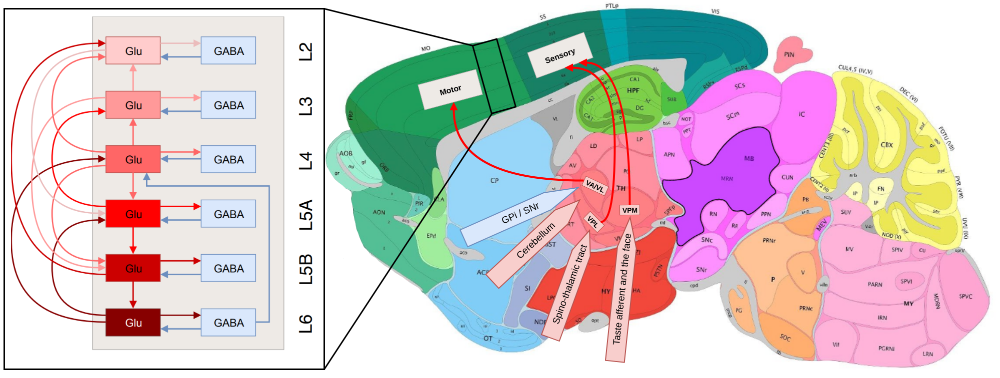

# Cortical column and HTM

## Cortical column connectome

## Learning

Each column receives feedforward sensory input from a different sensor array [e.g., different fingers or adjacent areas of the retina (not shown)]. The input layer combines sensory input with a modulatory location input to form sparse representations that correspond to features at specific locations on the object. The output layer receives feedforward inputs from the input layer and converges to a stable pattern representing the object (e.g., a coffee cup). Convergence in the second layer is achieved via two means. One is by integration over time as the sensor moves relative to the object, and the other is via modulatory lateral connections between columns that are simultaneously sensing different locations on the same object (blue arrows in upper layer). Feedback from the output layer to the input layer allows the input layer to predict what feature will be present after the next movement of the sensor.

## Prediction with cortical columns 

(A) The neocortex is divided into cellular layers. The panels in this figure show part of one generic cellular layer. For clarity, the panels only show 21 mini-columns with 6 cells per column. (B) Input sequences ABCD and XBCY are not yet learned. Each sequence element invokes a sparse set of mini-columns, only three in this illustration. All the cells in a mini-column become active if the input is unexpected, which is the case prior to learning the sequences. (C) After learning the two sequences, the inputs invoke the same mini-columns but only one cell is active in each column, labeled B′, B″, C′, C″, D′, and Y″. Because C′ and C″ are unique, they can invoke the correct high-order prediction of either Y or D.

(A) Both active cells (black) and depolarized/predicted cells (red) are shown. The first panel shows the unexpected input A, which leads to a prediction of the next input B′ (second panel). If the subsequent input matches the prediction then only the depolarized cells will become active (third panel), which leads to a new prediction (fourth panel). The lateral synaptic connections used by one of the predicted cells are shown in the rightmost panel. In a realistic network every predicted cell would have 15 or more connections to a subset of a large population of active cells. (B) Ambiguous sub-sequence “BC” (which is part of both ABCD and XBCY) is presented to the network. The first panel shows the unexpected input B, which leads to a prediction of both C′ and C″. The third panel shows the system after input C. Both sets of predicted cells become active, which leads to predicting both D and Y (fourth panel). In complex data streams there are typically many simultaneous predictions.

Area labeled “apical dendrites” is equivalent to layer 1 in neocortex; the apical dendrites (not shown) from all the cells terminate here. In the figure, the following assumptions have been made. The network has previously learned the sequence ABCD as was illustrated earlier. A constant feedback pattern was presented to the apical dendrites during the learned sequence, and the cells that participate in the sequence B′ C′D′ have formed synapses on their apical dendrites to recognize the constant feedback pattern. After the feedback connections have been learned, presentation of the feedback pattern to the apical dendrites is simultaneously recognized by all the cells that would be active sequentially in the sequence. These cells, shown in red, become depolarized (left pane). When a new feedforward input arrives it will lead to the sparse representation relevant to the predicted sequence (middle panel). If a feedforward pattern cannot be interpreted as part of the expected sequence (right panel) then all cells in the selected columns become active indicative of an anomaly. In this manner apical feedback biases the network to interpret any input as part of an expected sequence and detects if an input does not match any one of the elements in the expected sequence.

## References

[A Framework for Intelligence and Cortical Function Based on Grid Cells in the Neocortex](https://numenta.com/assets/pdf/research-publications/papers/Companion-paper-to-Thousand-Brains-Theory-of-Intelligence.pdf)

[A Theory of How Columns in the Neocortex Enable Learning the Structure of the World](https://www.frontiersin.org/articles/10.3389/fncir.2017.00081/full)

[Why Neurons Have Thousands of Synapses, a Theory of Sequence Memory in Neocortex](https://www.frontiersin.org/articles/10.3389/fncir.2016.00023/full)

[A Framework for Intelligence and Cortical Function Based on Grid Cells in the Neocortex](https://www.frontiersin.org/articles/10.3389/fncir.2018.00121/full)
