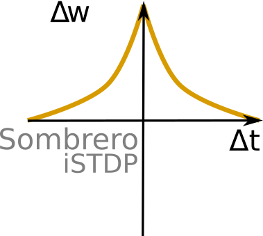
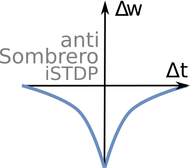
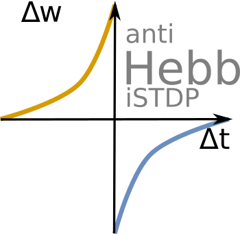
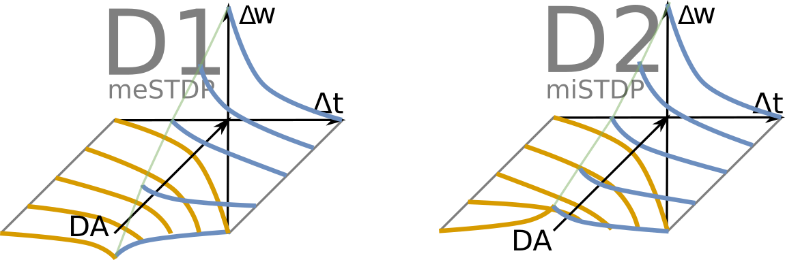

# Learning 

## Hebbian learning (excitatory)

"Fire together wire together"

## Reflex arc example 

## Inhibitory learning 

### Sombrero

### anti- * 

## Learning effects 

### Hebbian 

### Sombrero

### Sinusoidal 

## Neuromodulation [with dopamine]

## References

https://en.wikipedia.org/wiki/Connectome

Gurney, K. N., Humphries, M. D., & Redgrave, P. (2015). A New Framework for Cortico-Striatal Plasticity: Behavioural Theory Meets In Vitro Data at the Reinforcement-Action Interface. PLoS Biology, 13(1), e1002034. https://doi.org/10.1371/journal.pbio.1002034

Hennequin, G., Agnes, E. J., & Vogels, T. P. (2017). Inhibitory Plasticity: Balance, Control, and Codependence. Annual Review of Neuroscience, 40(1). Retrieved from http://www.annualreviews.org/doi/abs/10.1146/annurev-neuro-072116-031005

Vogels, T. P., Froemke, R. C., Doyon, N., Gilson, M., Haas, J. S., Liu, R., … Sprekeler, H. (2013). Inhibitory synaptic plasticity: spike timing-dependence and putative network function. Frontiers in Neural Circuits, 7, 119. https://doi.org/10.3389/fncir.2013.00119
