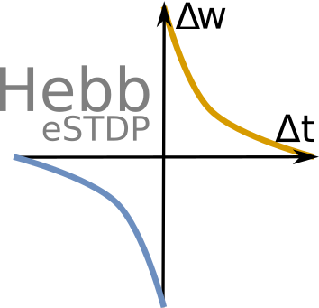

# Learning 

## Hebbian learning (excitatory)

"Fire together wire together"

## Reflex arc example 

## Inhibitory learning 

### Sombrero

### Sinusoidal 

### anti- * 

## Neuromodulation [with dopamine]

## References

https://en.wikipedia.org/wiki/Connectome

Gurney, K. N., Humphries, M. D., & Redgrave, P. (2015). A New Framework for Cortico-Striatal Plasticity: Behavioural Theory Meets In Vitro Data at the Reinforcement-Action Interface. PLoS Biology, 13(1), e1002034. https://doi.org/10.1371/journal.pbio.1002034

