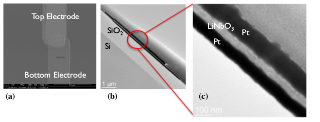
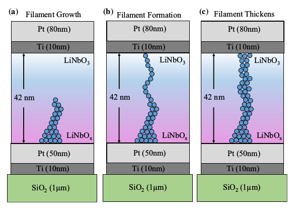
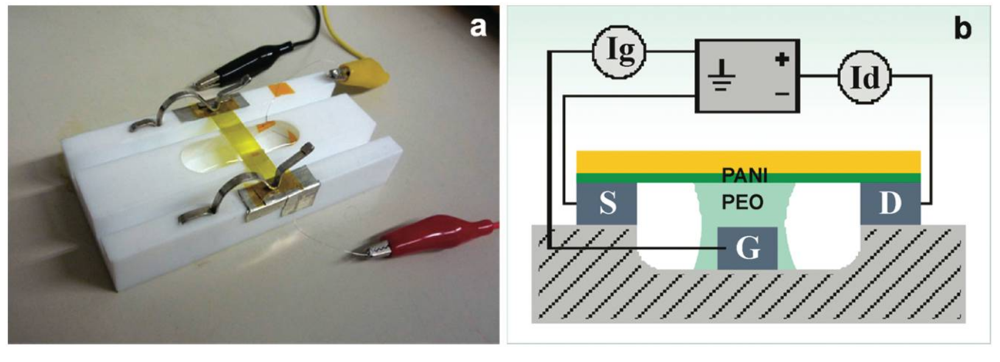
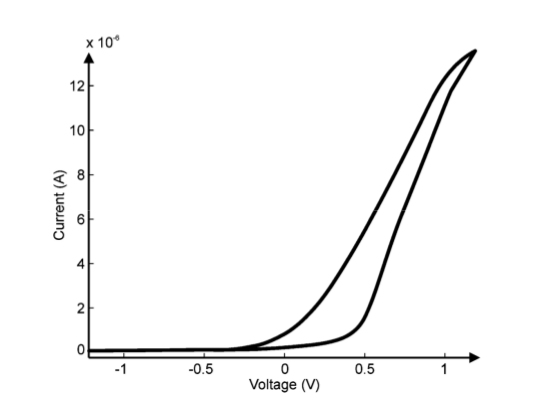
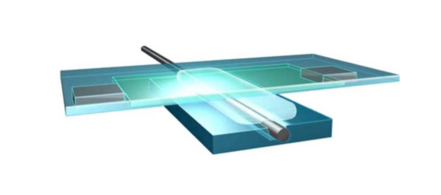
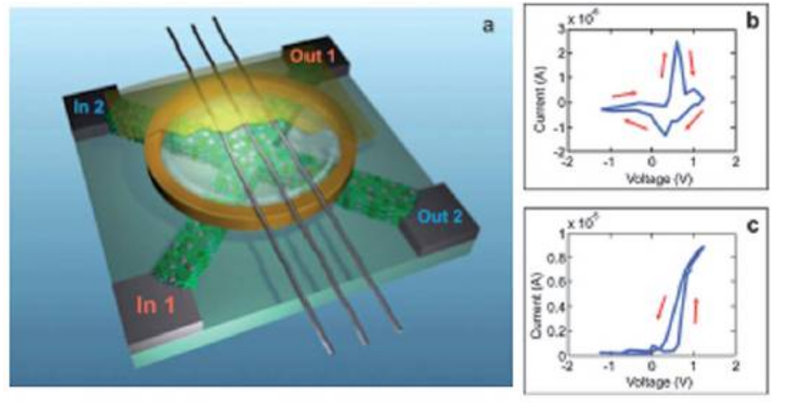
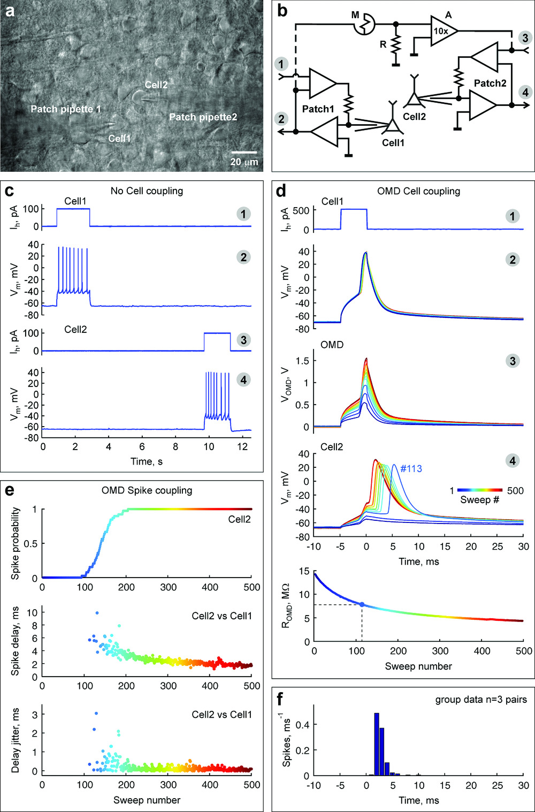
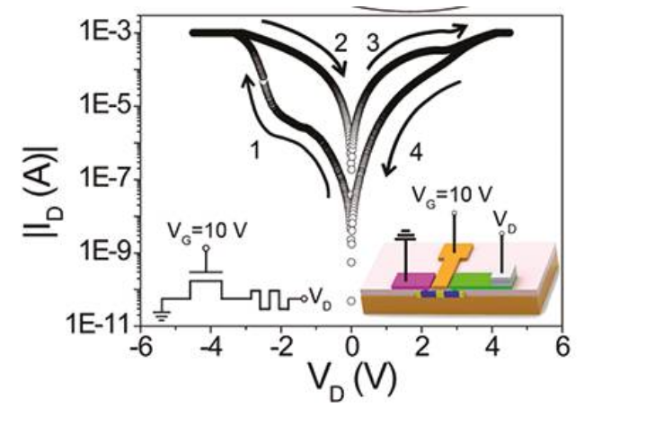

# Memristor 

## Idea of Leon Chua

 In contrast to a linear (or non-linear) resistor the memristor has a dynamic relationship between current and voltage including a memory of past voltages or currents.

 Memristor resistance depends on the integral of the input applied to the terminals rather than on the instantaneous value of the input. Since the element "remembers" the amount of current that last passed through, it was tagged by Chua with the name "memristor". 

Another way of describing a memristor is as any passive two-terminal circuit element that maintains a functional relationship between the time integral of current (called charge) and the time integral of voltage (often called flux, as it is related to magnetic flux). The slope of this function is called the *memristance M* and is similar to variable resistance. 

## Pinched hysteresis

## Memristive devices

### Inorganic

#### TiO2

#### LiNbO3

#### Filament 

[Filament formation movie](https://static-content.springer.com/esm/art%3A10.1038%2Fs41467-018-07979-0/MediaObjects/41467_2018_7979_MOESM5_ESM.mov)

### Organic 

#### PANI memristor

#### PANI sandwich

#### Stochastic network

#### PANI synapse prosthesis

## Applications

1. [ReRAM](https://en.wikipedia.org/wiki/Resistive_random-access_memory)

1. [ANN](https://en.wikipedia.org/wiki/Artificial_neural_network)
1. Neuromorphic prosthetics

## References

https://en.wikipedia.org/wiki/Memristor

Yakopcic, C., Wang, S., Wang, W., Shin, E., Boeckl, J., Subramanyam, G., & Taha, T. M. (2017). Filament formation in lithium niobate memristors supports neuromorphic programming capability. Neural Computing and Applications, 1-7.

Wang, W., Wang, M., Ambrosi, E., Bricalli, A., Laudato, M., Sun, Z., ... & Ielmini, D. (2019). Surface diffusion-limited lifetime of silver and copper nanofilaments in resistive switching devices. Nature communications, 10(1), 81.

Erokhin, V., & Fontana, M. P. (2008). Electrochemically controlled polymeric device: a memristor (and more) found two years ago. arXiv preprint arXiv:0807.0333.

ЕРОХИН, В. В. ОРГАНИЧЕСКИЕ МЕМРИСТОРНЫЕ ПРИБОРЫ И НЕЙРОМОРФНЫЕ СИСТЕМЫ.

Juzekaeva, E., Nasretdinov, A., Battistoni, S., Berzina, T., Iannotta, S., Khazipov, R., ... & Mukhtarov, M. (2018). Coupling Cortical Neurons through Electronic Memristive Synapse. Advanced Materials Technologies, 1800350.
