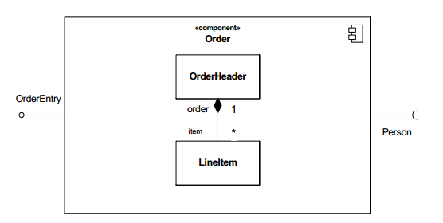
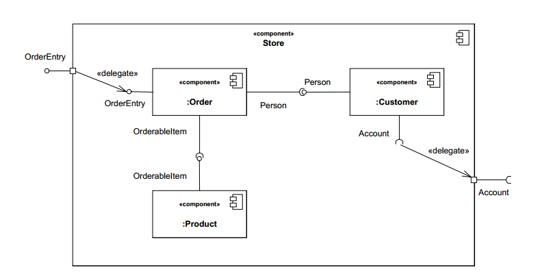

# Component diagram

[Component diagram](https://en.wikipedia.org/wiki/Component_diagram): describes how a software system is split up into components and shows the dependencies among these components.

## Classifiers

### Components

1. Black box

1. White box with listing of parts and connectors

1. White box with nested structure

### Ports

## Connectors

1. Provided interface
1. Required interface
1. Delegate
2. Assembly 
