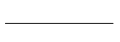

# Composit structure diagram.

[Composite structure diagram](https://en.wikipedia.org/wiki/Composite_structure_diagram) in the Unified Modeling Language (UML) is a type of static structure diagram, that shows the internal structure of a class and the collaborations that this structure makes possible.

This diagram can include internal parts, ports through which the parts interact with each other or through which instances of the class interact with the parts and with the outside world, and connectors between parts or ports. A composite structure is a set of interconnected elements that collaborate at runtime to achieve some purpose. Each element has some defined role in the collaboration.

## Constructs

### Part

### Port

### Collaboration

### CollaborationUse

## Connectors

### Connector

### Role binding

