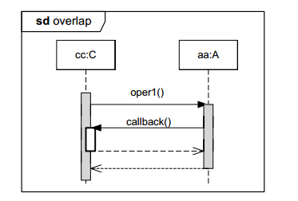

# Sequence diagram.

[Sequence diagram](https://en.wikipedia.org/wiki/Sequence_diagram) is a kind of interaction diagram that shows how processes operate with one another and in what order. It is a construct of a Message Sequence Chart. A sequence diagram shows object interactions arranged in time sequence. It depicts the objects and classes involved in the scenario and the sequence of messages exchanged between the objects needed to carry out the functionality of the scenario. Sequence diagrams are typically associated with use case realizations in the Logical View of the system under development.

## Constructs

### Lifeline and execution

### CombinedFragment

Combined fragment with critical region.

### Continuation (alternative branches)

Here: ref - reference(inclusion) to other sequence.

### Overlap

## Connectors

